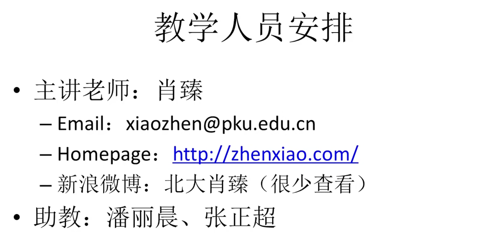

# 北京大学肖臻老师《区块链技术与应用》公开课

## 1.01-课程简介(Av37065233,P1)

课程封面 图片来源：https://www.bilibili.com/video/BV1Vt411X7JF

欢迎参加北京大学计算机系开设的《区块链技术与应用》课程。本课程面向计算机科学与技术、人工智能等相关专业研究生，要求学员具备数据结构、算法基础及编程实践经验。课程由计算机系肖臻研究员主持，聚焦区块链核心技术原理与实践应用。

区块链作为近年来备受瞩目的前沿技术，其本质定位在业界存在多维解读。区块链的本质是什么？有人说区块链是下一代的互联网，也有人说它是世界上最慢的数据库。如果你把它当数据库用的话，它是非常的慢，而且只实现了数据库中很小一部分功能。

从技术发展史的角度观察，鲜有技术革新如区块链这般引发两极化的认知分野。有人把区块链捧上了天，把区块链的出现跟工业革命相提并论。也有很多贬低区块链的，把区块链说成是庞氏骗局。大量所谓"区块链专家"实则停留在概念演绎层面，其讨论焦点往往偏离技术内核。本课程体系的设计正是针对当前区块链领域普遍存在的认知鸿沟问题！

比特币图标 图片来源：https://bitcoin.org

比特币价格走势 图片来源：https://www.google.com/finance/

根据上述图表，旨在阐明以下两点：首先，​当前涉足区块链领域并不算晚。​从区块链整体发展来看，现阶段仍处于发展阶段。​因此，​从现在开始参与，您将成为这一领域的先行者。​其次，​区块链技术的应用远超比特币。​比特币仅是基于区块链技术的加密货币之一。​区块链作为一种分布式账本技术，​在金融、供应链管理、医疗等多个领域都有广泛应用。​因此，不应将区块链的潜力局限于比特币。​

加密货币市场份额 图片来源：https://www.coingecko.com/

从图中可以看出，在早期，比特币几乎占据了整个市场，其他加密货币的份额非常小。然而，随着时间的推移，比特币的市场份额逐渐萎缩，其在市场中的占比有所下降，里边一个标志性事件是以太坊的出现。

以太坊图标 图片来源：https://ethereum.org 

以太坊（Ethereum）于2015年正式推出，最初并未引起广泛关注，但随着时间推移，它逐渐发展成为主流的加密货币之一。 ​本课程将重点讨论比特币和以太坊这两种加密货币。

本课程面向计算机专业的研究生，希望同学们在本科阶段已具备扎实的计算机基础，包括对数据结构、算法和编程的深入理解。

​本课教材：Bitcoin and Cryptocurrency Technologies

该书于2016年出版，提供了对比特币及相关加密货币技术的深入介绍。​您可以选择购买中英文版本，市面上均有销售。需要注意的是，尽管该教材在出版时具有权威性，但由于加密货币技术的快速发展，部分内容可能已显得过时。

《Bitcoin and Cryptocurrency Technologies》主要聚焦于比特币，对于以太坊的学习，我们建议参考以下资源：
- **以太坊白皮书和黄皮书**：白皮书（[Ethereum White Paper](https://github.com/ethereum/wiki/wiki/White-Paper)）详细阐述了以太坊的设计理念和目标；黄皮书（[Ethereum Yellow Paper](https://ethereum.github.io/yellowpaper/paper.pdf)）则提供了以太坊协议的正式规范。

- **Solidity文档**：Solidity是用于编写以太坊智能合约的主要编程语言。官方文档（[Solidity Documentation](https://docs.soliditylang.org/zh-cn/latest/)）提供了语言的详细介绍和使用指南。

- **《精通以太坊》**：这本书深入探讨了以太坊的架构和应用，适合希望深入了解以太坊的读者。

- **以太坊源码分析**：由于以太坊技术发展迅速，源码可能与文档存在差异。建议直接阅读以太坊的源代码（[Go-Ethereum](https://github.com/ethereum/go-ethereum)），并参考社区对源码的解析，例如对以太坊下载器模块的分析（[以太坊源码解析：区块同步-downloader](https://yangzhe.me/2019/05/09/ethereum-downloader/)）。

在学习过程中，建议将官方文档、权威书籍和源代码相结合，培养从代码出发理解技术的能力。遇到疑惑时，优先查阅源代码，以确保对以太坊技术的准确理解。

图片来源：https://www.bilibili.com/video/BV1Vt411X7JF

