**10.10-BTC-分叉(Av37065233,P10)**

### 什么是分叉

分叉（Fork）是区块链网络中的一种现象，指原来的单一链条分裂成两条或多条并行的链条。

#### 分叉基本概念图

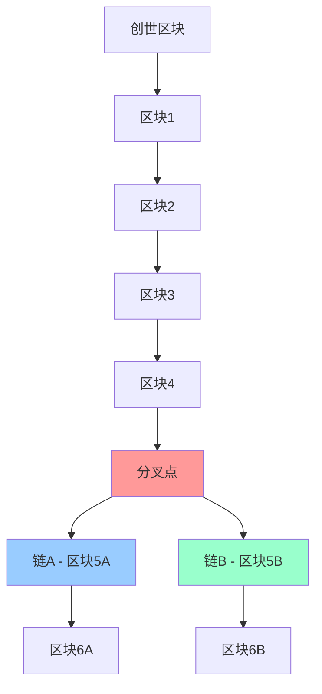

### 分叉产生的原因

| 分叉类型 | 产生原因 | 持续时间 | 解决方式 |
|----------|----------|----------|----------|
| **临时分叉** | 同时挖矿 | 短期 | 最长链原则 |
| **分叉攻击** | 恶意攻击 | 中期 | 算力竞争 |
| **协议分叉** | 软件升级 | 长期 | 社区共识 |

## 状态分叉（State Fork）

### 同时挖矿产生的分叉

状态分叉是由于网络中节点对区块链当前状态产生意见分歧而导致的分叉。

#### 同时挖矿分叉时序图

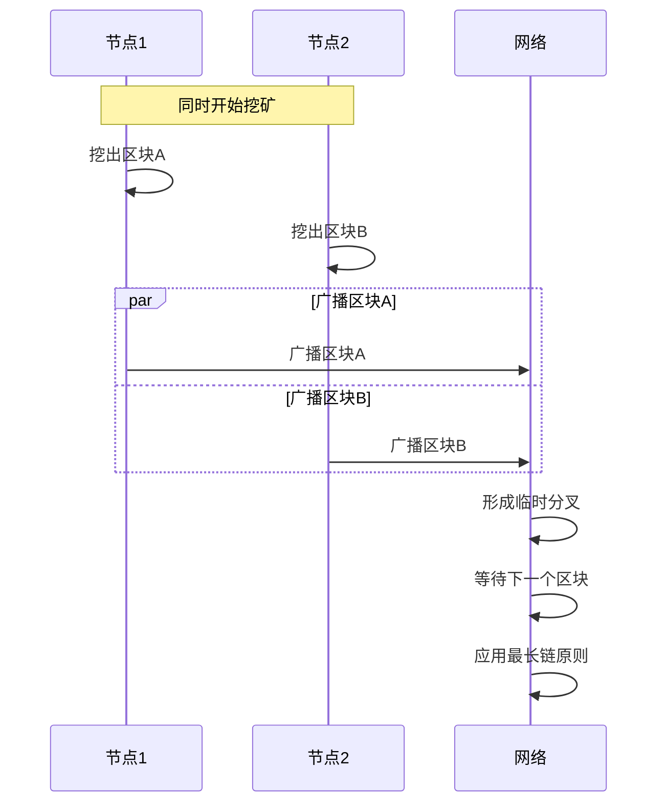

**特点**：
- 两个节点几乎同时挖出区块
- 网络中同时出现两个有效区块
- 通过最长链原则自动解决

### 分叉攻击（Forking Attack）

#### 分叉攻击策略图

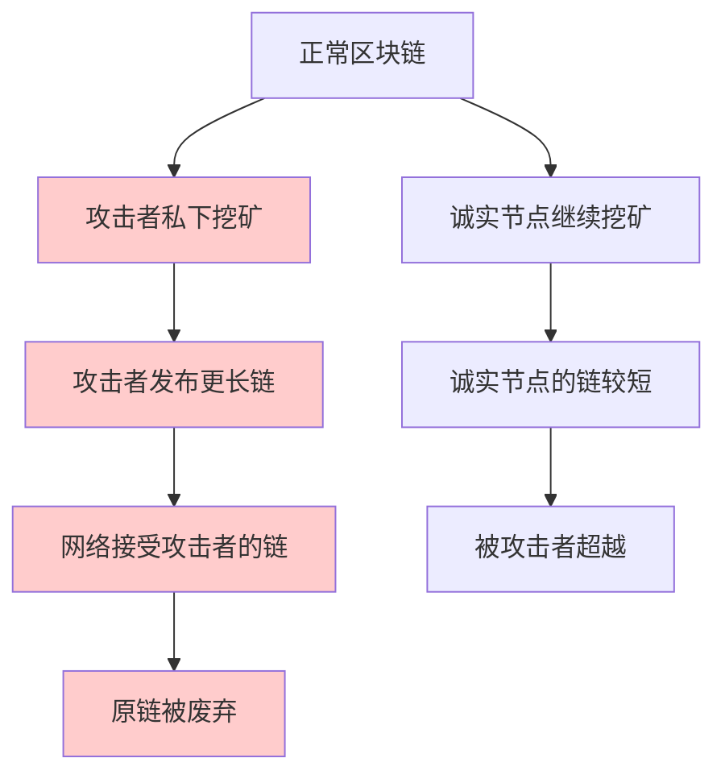

**攻击过程**：
1. 攻击者暗中挖矿，不公布区块
2. 积累足够长的私有链
3. 一次性发布，替换公开链
4. 实现双花攻击

#### 攻击成功条件分析表

| 条件 | 要求 | 难度 | 成功率 |
|------|------|------|--------|
| **算力控制** | >50% 网络算力 | 🔴 极高 | 理论可行 |
| **时间窗口** | 足够长的挖矿时间 | 🟡 中等 | 需要耐心 |
| **网络延迟** | 利用网络传播延迟 | 🟢 较低 | 辅助条件 |
| **目标价值** | 攻击收益>成本 | 🟡 中等 | 经济考量 |

## 协议分叉（Protocol Fork）

### 协议分叉的产生

协议分叉是由于比特币协议发生改变，需要软件升级而产生的分叉。

#### 协议升级分布图

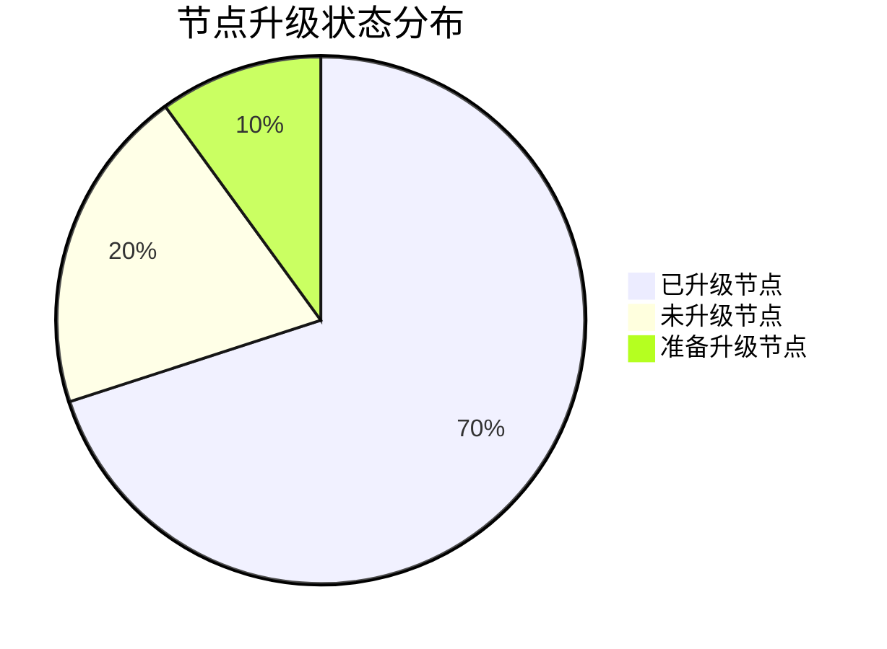

**升级场景**：
- 大部分节点升级了软件
- 少数节点未升级（来不及或不同意）
- 不同版本协议产生分歧

### 分叉类型对比

| 特征 | 硬分叉 | 软分叉 |
|------|--------|--------|
| **英文名称** | Hard Fork | Soft Fork |
| **向后兼容** | 不兼容 | 兼容 |
| **升级要求** | 所有节点必须升级 | 只需多数节点升级 |
| **分叉持续** | 永久性 | 临时性 |
| **社区分裂** | 可能分裂 | 不会分裂 |

## 硬分叉（Hard Fork）

### 硬分叉的特征

硬分叉是对协议的放宽，添加新功能或特性，使原本非法的操作变为合法。

#### 硬分叉节点状态图

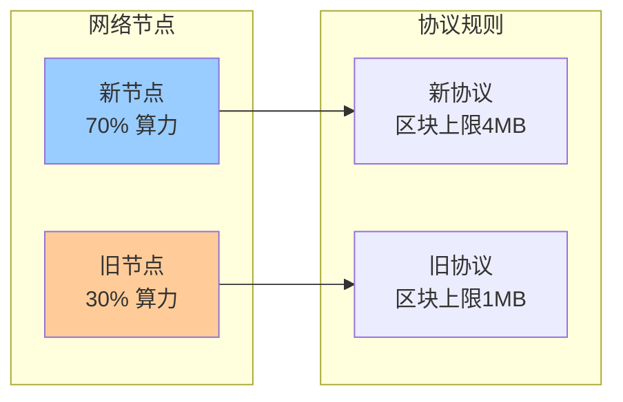

### 区块大小限制案例

#### 比特币吞吐量计算表

| 参数 | 数值 | 单位 | 说明 |
|------|------|------|------|
| **区块大小** | 1 | MB | 比特币区块上限 |
| **字节数** | 1,000,000 | Bytes | 1MB = 1百万字节 |
| **交易大小** | 250 | Bytes | 平均每笔交易 |
| **每区块交易数** | 4,000 | 笔 | 1MB ÷ 250B |
| **出块时间** | 10 | 分钟 | 平均挖矿时间 |
| **每秒交易数** | 7 | TPS | 4000笔 ÷ 600秒 |

#### 性能对比表

| 支付系统 | 每秒处理能力(TPS) | 数量级差距 |
|----------|-------------------|------------|
| **比特币** | 7 | 基准 |
| **以太坊** | 15 | 2倍 |
| **Visa** | 24,000 | 3,400倍 |
| **Mastercard** | 38,000 | 5,400倍 |
| **支付宝** | 256,000 | 36,500倍 |

### 硬分叉执行过程

#### 硬分叉分裂时序图

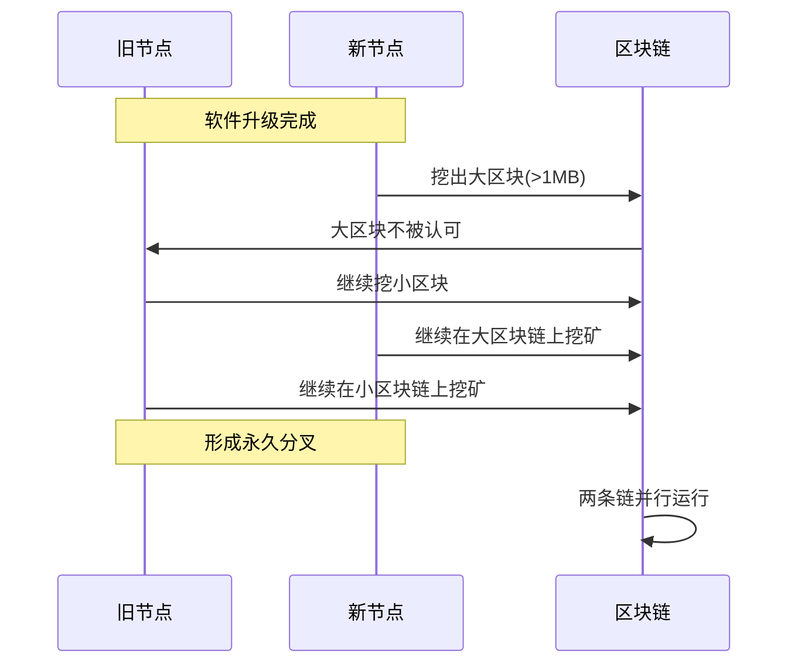

**分叉过程**：
1. 新节点挖出大区块（>1MB）
2. 旧节点不认可大区块
3. 旧节点继续挖小区块
4. 新节点认可所有区块
5. 形成永久性分叉

### 硬分叉后的影响

#### 分叉后资产状态表

| 影响维度 | 分叉前 | 分叉后链A | 分叉后链B |
|----------|--------|-----------|-----------|
| **加密货币** | 1种BTC | 新BTC | 旧BTC |
| **挖矿奖励** | 统一奖励 | 链A奖励 | 链B奖励 |
| **交易记录** | 共享历史 | 独立记录 | 独立记录 |
| **社区支持** | 统一社区 | 支持者A | 支持者B |
| **市场价值** | 单一价格 | 价格A | 价格B |

#### 以太坊经典分叉案例

**历史背景**：
- 2016年，以太坊发生著名的DAO攻击事件
- 攻击者利用智能合约漏洞盗取大量以太币
- 社区分裂为两派：支持回滚和反对回滚

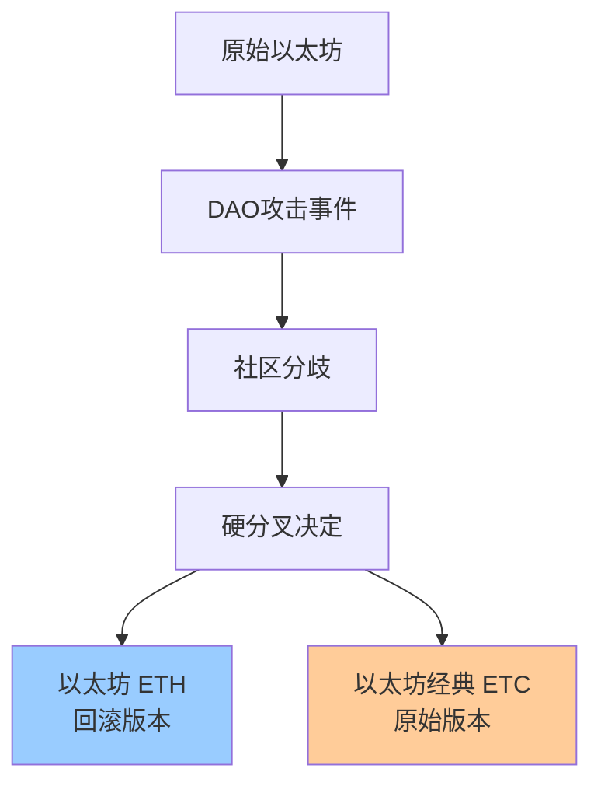

**分叉结果**：
- ETH：回滚攻击，资金返还给投资者
- ETC：保持原始区块链，不进行回滚
- 两个币种都在交易所交易

### 重放攻击问题

#### 重放攻击机制图

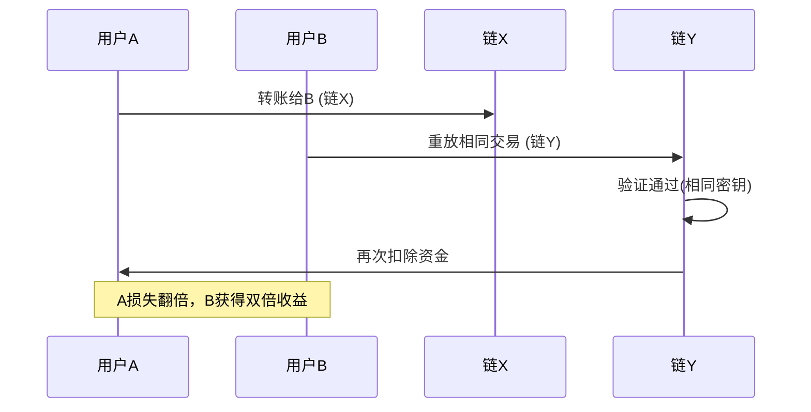

**攻击原理**：
- 分叉后两链密钥体系相同
- 在链A的交易可以在链B重放
- 用户可能在两条链都被扣款

**解决方案**：
- 为每条链分配唯一ID
- 交易签名包含链ID
- 防止跨链重放攻击

## 软分叉（Soft Fork）

### 软分叉的特征

软分叉是对协议的收紧，添加新的限制规则，使原本合法的操作变为非法。

#### 软分叉节点兼容性图

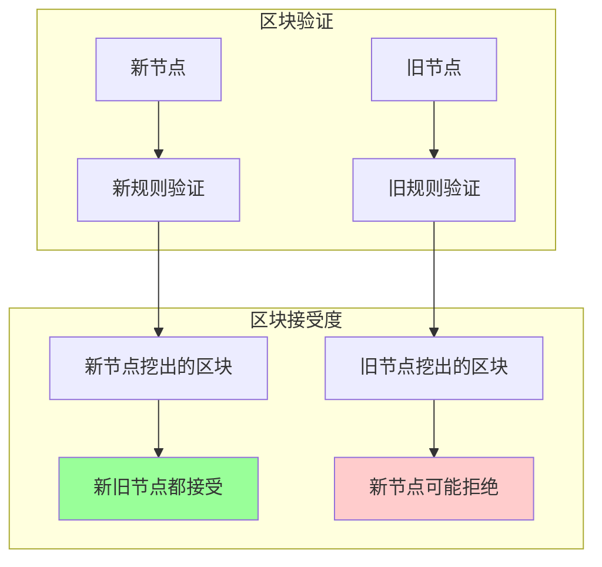

### 软分叉示例：区块大小缩减

#### 软分叉执行流程图

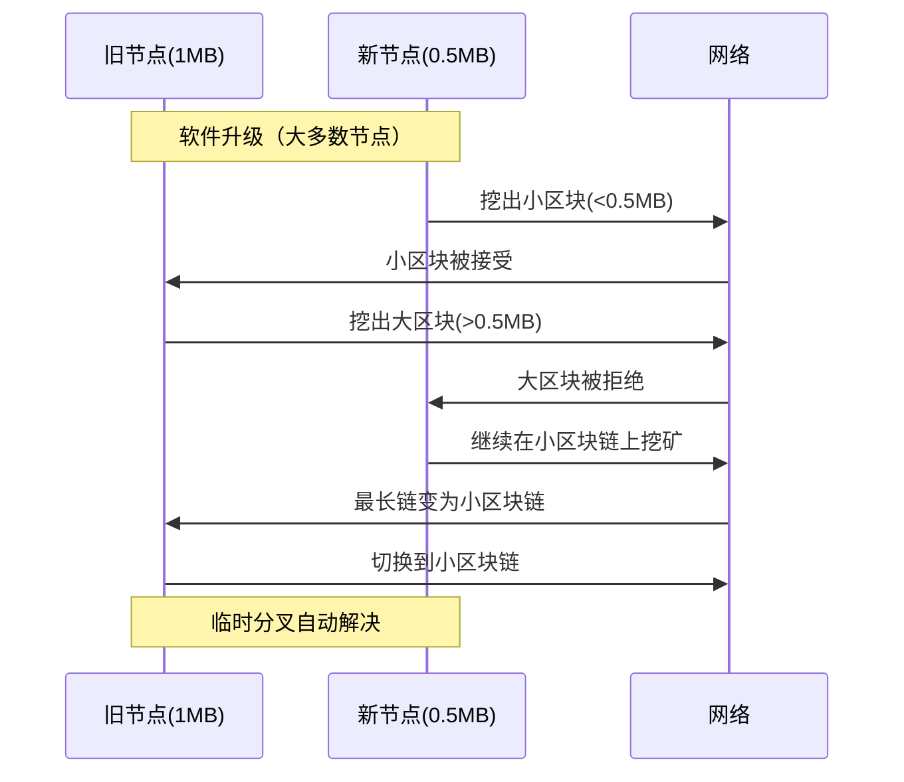

**关键特点**：
- 新节点挖出小区块，旧节点接受
- 旧节点挖出大区块，新节点拒绝
- 旧节点最终跟随最长链原则

### 软分叉的自愈机制

#### 分叉自愈过程表

| 阶段 | 新节点行为 | 旧节点行为 | 网络状态 |
|------|------------|------------|----------|
| **初始** | 挖小区块 | 挖大区块 | 出现分叉 |
| **竞争** | 拒绝大区块 | 接受小区块 | 算力竞争 |
| **收敛** | 形成最长链 | 切换到最长链 | 分叉解决 |
| **稳定** | 继续挖小区块 | 被迫挖小区块 | 网络统一 |

**自愈原理**：
- 新节点占据大多数算力
- 小区块链更容易成为最长链
- 旧节点被迫跟随最长链

## 软分叉实际应用

### Coinbase域扩展

#### Coinbase交易结构图

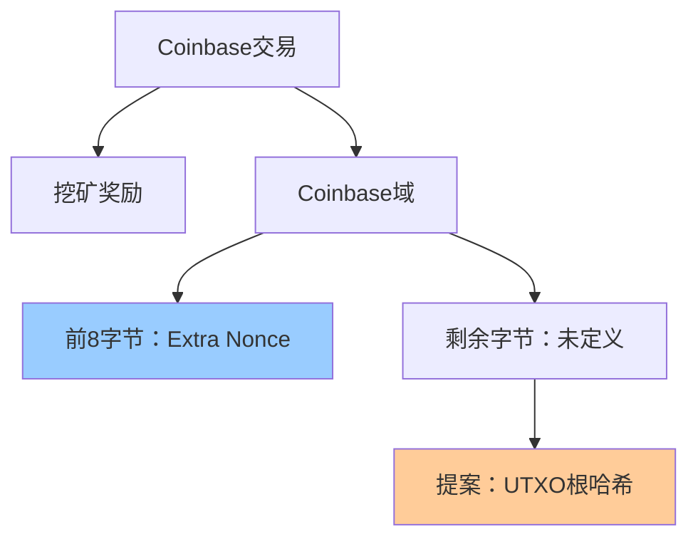

#### 挖矿搜索空间计算表

| 参数 | 位数 | 搜索空间 | 当前状态 |
|------|------|----------|----------|
| **Block Header Nonce** | 32位 | 2³² ≈ 43亿 | 不够用 |
| **Extra Nonce** | 64位 | 2⁶⁴ | 扩展空间 |
| **总搜索空间** | 96位 | 2⁹⁶ | 足够使用 |

### UTXO集合证明

#### UTXO证明机制图

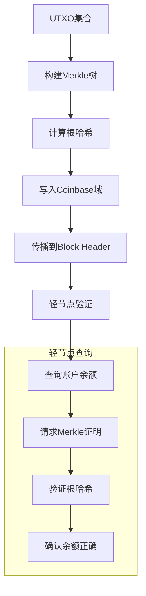

**解决问题**：
- 轻节点无法验证账户余额
- 需要信任全节点的回复
- 通过Merkle证明实现可验证性

### Pay-to-Script-Hash (P2SH)

#### P2SH验证流程图

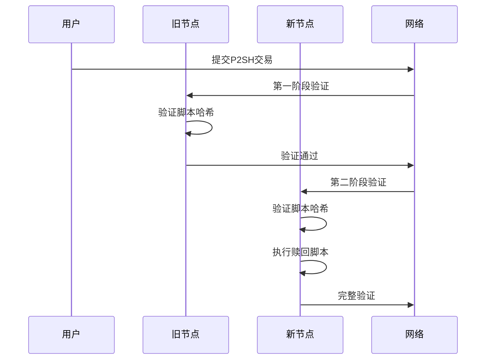

#### P2SH验证对比表

| 节点类型 | 验证阶段 | 验证内容 | 验证结果 |
|----------|----------|----------|----------|
| **旧节点** | 第一阶段 | 脚本哈希匹配 | 部分验证 |
| **新节点** | 第一阶段 | 脚本哈希匹配 | 通过 |
| **新节点** | 第二阶段 | 执行赎回脚本 | 完整验证 |

**兼容性**：
- 旧节点认为合法的交易，新节点可能拒绝
- 新节点认为合法的交易，旧节点一定接受
- 符合软分叉定义

## 分叉类型总结

### 硬分叉 vs 软分叉对比

#### 综合特征对比表

| 比较维度 | 硬分叉 | 软分叉 |
|----------|--------|--------|
| **协议变化** | 放宽限制 | 收紧限制 |
| **向后兼容** | 不兼容 | 兼容 |
| **升级要求** | 所有节点必须升级 | 多数算力升级即可 |
| **分叉持续** | 永久性 | 临时性 |
| **社区风险** | 可能永久分裂 | 不会分裂 |
| **实施难度** | 较高 | 较低 |
| **风险程度** | 高风险 | 低风险 |

### 分叉决策原则

#### 分叉选择决策树

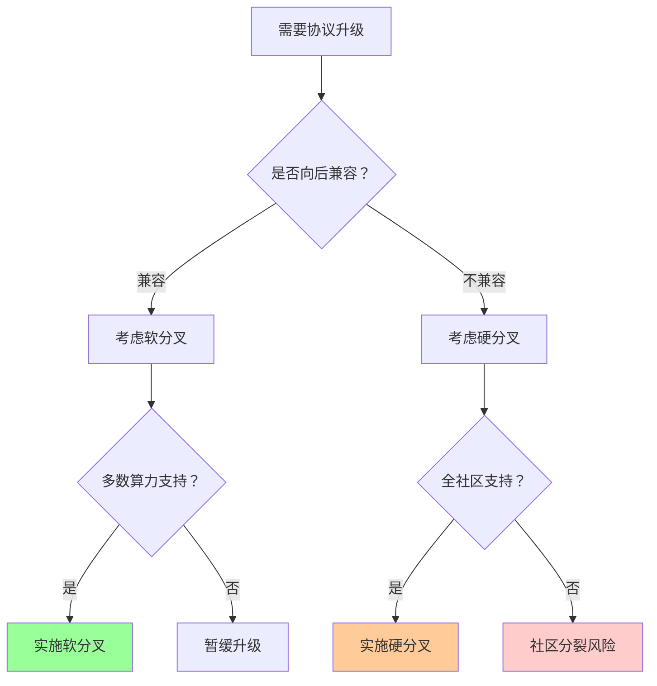

### 升级策略建议

#### 升级风险评估表

| 风险类型 | 硬分叉风险 | 软分叉风险 | 缓解措施 |
|----------|------------|------------|----------|
| **技术风险** | 🔴 高 | 🟡 中 | 充分测试 |
| **社区风险** | 🔴 高 | 🟢 低 | 提前沟通 |
| **经济风险** | 🔴 高 | 🟡 中 | 影响评估 |
| **时间风险** | 🟡 中 | 🟢 低 | 分阶段实施 |

**建议原则**：
1. 优先考虑软分叉
2. 硬分叉需要社区广泛共识
3. 做好充分的测试和准备
4. 考虑分阶段实施

## 总结

### 核心要点

1. **分叉是区块链升级的必经之路**
   - 去中心化系统无法强制同步升级
   - 分叉是技术演进的自然结果

2. **理解分叉类型至关重要**
   - 硬分叉：扩展功能，需要全员升级
   - 软分叉：收紧规则，多数升级即可

3. **社区共识是关键**
   - 技术可行性只是基础
   - 社区接受度决定最终成败

4. **风险管理不可忽视**
   - 分叉可能导致社区分裂
   - 经济损失和技术风险并存

### 实践指导

| 参与角色 | 关注重点 | 行动建议 |
|----------|----------|----------|
| **开发者** | 技术兼容性 | 优先软分叉设计 |
| **矿工** | 算力分配 | 跟随主流共识 |
| **用户** | 资产安全 | 关注官方公告 |
| **投资者** | 市场影响 | 评估分叉风险 |

比特币分叉机制体现了去中心化系统的复杂性，也展示了区块链技术的进化能力。理解分叉原理有助于更好地参与和投资区块链项目。