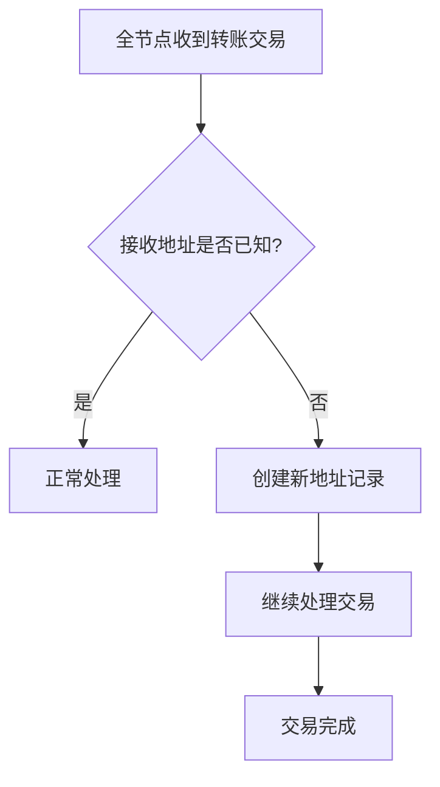
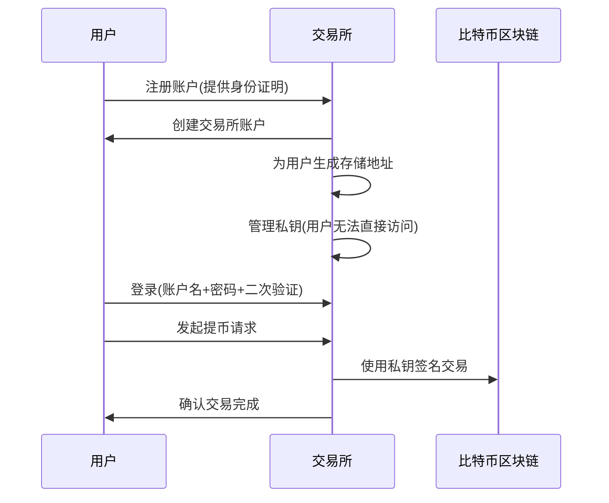
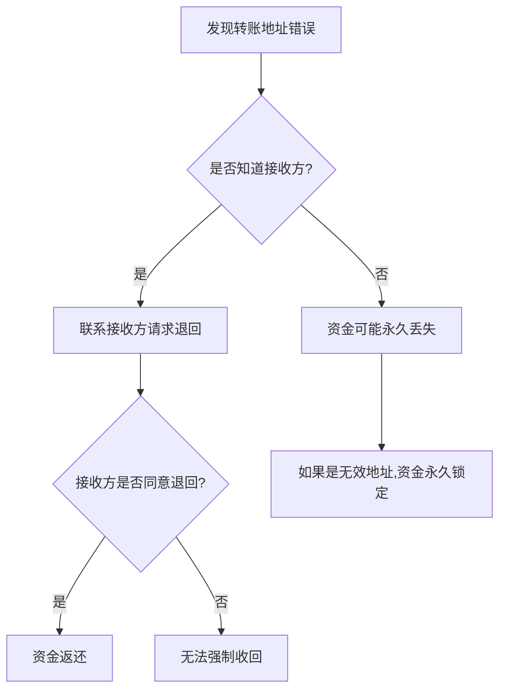
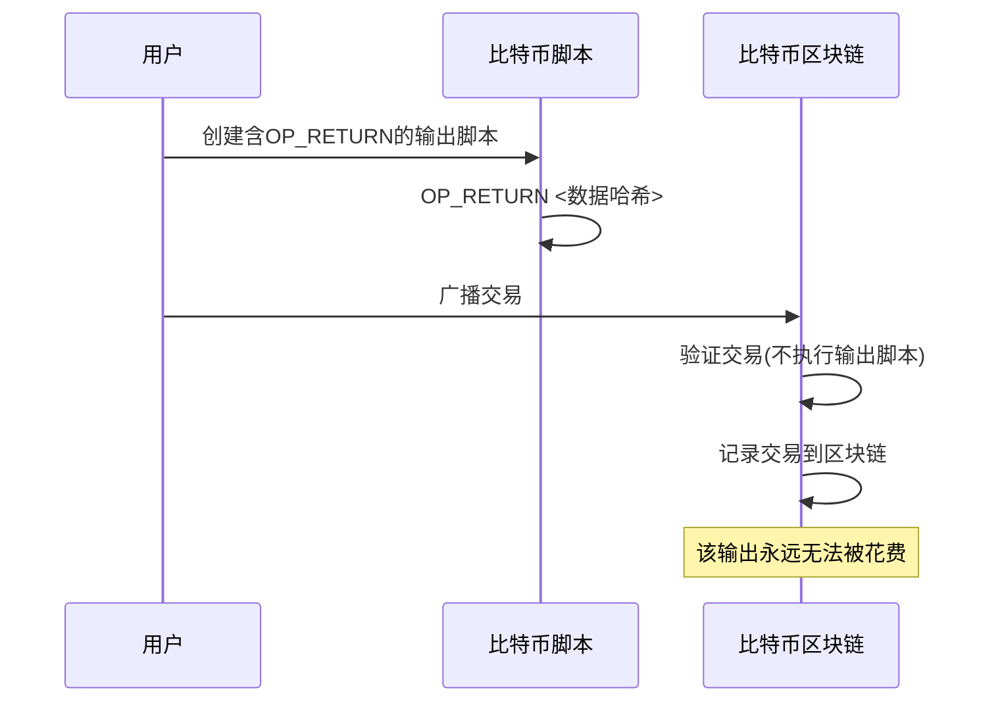
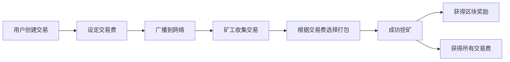
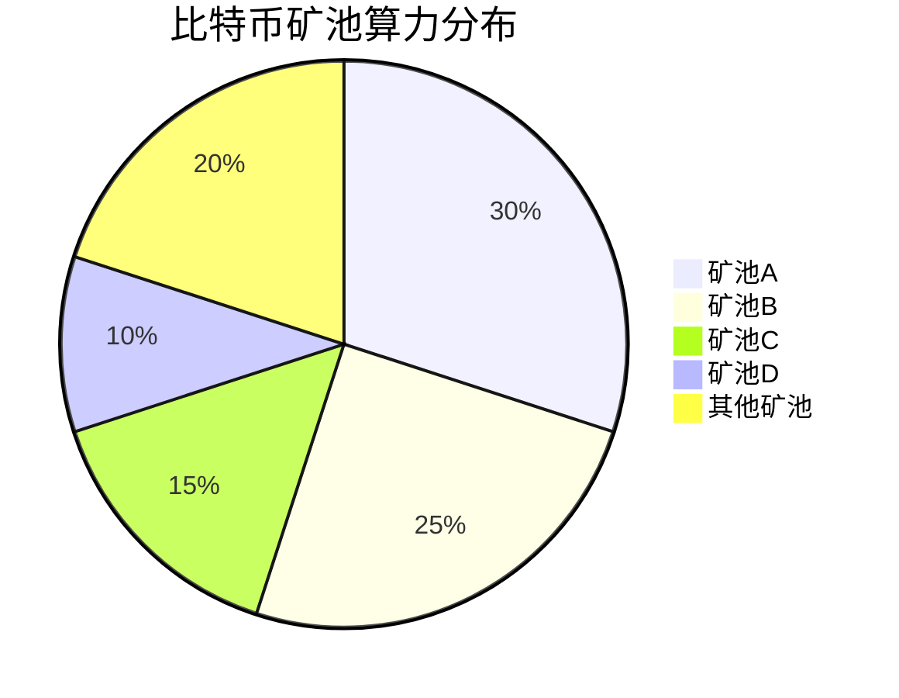

**11-BTC-问答优化版 (Av37065233, P11)**

## 比特币系统常见问题解析

本章通过问答形式回顾比特币系统的关键概念，帮助深化对比特币技术细节的理解。

### 比特币转账基础问题

#### 离线接收者问题

| 问题 | 解答 | 技术原理 |
|------|------|----------|
| **转账时接收者不在线怎么办？** | 不影响转账 | 区块链只需记录所有权变更 |
| **为什么接收者不需要在线？** | 只需知道接收者地址 | 转账是公钥哈希的所有权转移 |
| **与传统支付的区别** | 传统支付需双方在线 | 比特币只需发送方在线 |

**技术解析**：
- 比特币转账本质是区块链上的记录变更
- 接收方地址（公钥哈希）是唯一所需信息
- 系统不要求接收方确认接收
- 接收方可在任何时间查看和使用收到的比特币

#### 新地址识别问题



**问题**：全节点收到转账交易时，接收者地址可能是从未见过的地址，系统如何处理？

**解答**：
- 这是完全可能的
- 比特币账户创建不需要通知网络
- 本地生成公私钥对即可创建账户
- 只有首次收款时，其他节点才知道该地址存在

**知识补充**：
- 比特币地址是去中心化生成的，无需注册
- 理论上可能存在的比特币地址数量约为2^160个
- 地址首次出现在交易中时自动被网络接受

### 账户安全与私钥管理

#### 私钥丢失问题

| 情况 | 后果 | 解决方案 | 风险等级 |
|------|------|----------|----------|
| **私钥丢失** | 账户资金永久无法取出 | 无法恢复 | 🔴 灾难性 |
| **私钥泄露** | 资金可能被盗 | 尽快转移资金 | 🔴 严重 |
| **地址错误** | 资金可能发送至错误地址 | 无法撤回交易 | 🔴 严重 |

**私钥丢失后果**：
- 账户资金变成"死钱"，永远无法取出
- 没有任何机构可以重置或恢复私钥
- 与传统银行体系完全不同，无法通过身份验证找回

**知识补充**：
- 据估计，约有300-400万个比特币因私钥丢失而永久锁定
- 这些"死钱"占比特币总供应量的15-20%
- 私钥管理是比特币持有者的核心责任

#### 中心化交易所与私钥管理



**交易所私钥管理**：
- 交易所是中心化机构，需要身份验证
- 交易所为用户管理私钥，用户无直接访问权
- 用户通过账户名、密码和二次验证登录
- 密码丢失可通过身份验证重置

**安全风险**：
- 交易所可能被黑客攻击（如Mt.Gox事件）
- 管理层可能卷款跑路
- 监管不完善，用户保护机制有限

**Mt.Gox事件简述**：
- 曾是全球最大比特币交易所，交易量占比70%
- 2014年被黑客攻击，丢失约85万枚比特币
- 价值约4.5亿美元（当时价格）
- 交易所破产，CEO被判刑

**安全建议**：
- 大额资金考虑使用冷钱包或硬件钱包
- 不要将全部资产存放在单一交易所
- 启用所有可用的安全措施（二次验证等）

### 比特币交易安全问题

#### 私钥泄露应对

| 应对步骤 | 传统银行账户 | 比特币账户 |
|----------|--------------|------------|
| **发现异常** | 联系银行冻结账户 | 无法冻结账户 |
| **阻止交易** | 可撤销未处理交易 | 无法撤销交易 |
| **密码重置** | 可通过身份验证重置 | 私钥无法更改 |
| **资金保护** | 可申请赔偿或保险 | 必须自行转移资金 |
| **应急措施** | 多重保障机制 | 只能尽快转移资金 |

**私钥泄露后的唯一应对**：
- 立即将资金转移到安全账户
- 争取在攻击者之前完成转移
- 旧地址永久作废，不再使用

**知识补充**：
- 比特币系统中无法"更改"私钥
- 新账户需要重新生成公私钥对
- 私钥一旦泄露，对应地址永久不安全

#### 转账错误处理



**转账错误后果**：
- 比特币交易不可撤销
- 如知道接收方，只能协商退回
- 如转入无效地址，资金永久丢失

**无效地址示例**：
- 使用文件哈希值伪装成比特币地址
- 这种地址没有对应私钥
- 转入的比特币永远无法被取出

### 比特币脚本与数据存储

#### OP_RETURN使用机制

| 脚本组件 | 功能 | 位置 | 执行时机 |
|----------|------|------|----------|
| **输入脚本** | 提供解锁条件 | 当前交易 | 验证当前交易时 |
| **输出脚本** | 设定锁定条件 | 当前交易 | 花费该输出时 |
| **OP_RETURN** | 存储任意数据 | 输出脚本 | 花费该输出时 |

**OP_RETURN执行机制**：
- OP_RETURN位于输出脚本中
- 验证当前交易时不会执行输出脚本
- 只有当后续交易尝试花费该输出时才会执行
- 执行时会无条件返回错误，使该输出永远无法花费

**知识补充**：
- OP_RETURN允许在交易中存储最多80字节数据
- 这是比特币协议认可的存储任意数据的方法
- 与伪装成地址的方法相比，更加节省存储空间

#### 数据存储标准方法



**标准数据存储方法**：
```
OP_RETURN <数据哈希>
```

**非标准方法问题**：
- 有人使用假地址存储数据（将数据哈希伪装成地址）
- 这会导致UTXO永久膨胀
- 全节点必须永久保存这些无法花费的输出
- 对网络不友好

### 挖矿与区块验证

#### 挖矿答案偷窃问题

| 挖矿组件 | 内容 | 变更影响 | 安全保障 |
|----------|------|----------|----------|
| **Coinbase交易** | 矿工收款地址 | 改变整个区块哈希 | 防止答案偷窃 |
| **Merkle树根** | 所有交易哈希 | 改变区块头哈希 | 交易完整性验证 |
| **区块哈希** | 区块头哈希值 | 需重新计算Nonce | 工作量证明 |

**为什么不能偷答案**：
- 每个矿工的Coinbase交易不同（收款地址不同）
- 改变Coinbase交易会导致Merkle树根变化
- Merkle树根变化会导致区块头哈希变化
- 原来找到的Nonce值不再有效

**知识补充**：
- 区块头包含：版本号、前区块哈希、Merkle树根、时间戳、难度目标、Nonce
- 任何组件变化都会导致区块哈希完全不同
- 这确保了挖矿工作无法被窃取

#### 交易费分配机制



**交易费计算**：
```
交易费 = 总输入 - 总输出
```

**交易费分配**：
- 事先不需要指定哪个矿工获得交易费
- 哪个矿工成功挖出区块，就获得该区块内所有交易费
- 矿工会优先选择交易费高的交易打包

**知识补充**：
- 随着区块奖励减半，交易费将成为矿工主要收入
- 交易拥堵时，交易费市场形成竞价机制
- 用户可以通过提高交易费加速确认速度

## 比特币网络统计数据分析

### 区块链规模增长趋势

| 数据类型 | 增长趋势 | 主要原因 | 影响 |
|----------|----------|----------|------|
| **区块链大小** | 持续增长 | 区块链只增不减特性 | 存储需求增加 |
| **UTXO集合** | 总体增长(有波动) | 交易增多、死币累积 | 内存需求增加 |
| **矿池集中度** | 高度集中 | 规模经济效应 | 中心化风险 |

**区块链大小特点**：
- 区块链是"只增不减"的数据结构
- 随着新区块不断产生，总大小持续增长
- 目前区块链大小对硬盘容量而言仍可接受

**UTXO集合增长原因**：
- 比特币交易数量增加
- 私钥丢失导致的"死币"累积
- UTXO必须保存在内存中以便快速验证

### 挖矿集中化现象



**挖矿集中化问题**：
- 少数大型矿池控制了大部分算力
- 带来潜在的51%攻击风险
- 违背去中心化的初衷

**知识补充**：
- 规模经济效应导致挖矿集中化
- 大型矿池可提供更稳定的收益
- 矿池之间存在复杂的竞争关系

### 交易数据分析

| 数据指标 | 变化趋势 | 影响因素 | 意义 |
|----------|----------|----------|------|
| **交易量(美元)** | 波动增长 | 价格波动、使用增加 | 网络价值流通 |
| **每日交易数** | 总体增长 | 用户增加、应用拓展 | 网络活跃度 |
| **区块交易数** | 与每日交易数相关 | 区块大小限制 | 网络吞吐能力 |

**交易数据特点**：
- 交易量(美元计)受比特币价格波动影响大
- 每日交易数反映实际网络使用情况
- 每个区块的交易数受1MB区块大小限制

**区块容量分析**：
- 理论上限约4000笔交易/区块
- 实际平均约1500笔交易/区块
- 区块未满与扩容争议并存

## 总结与思考

比特币系统通过精心设计的密码学原理和经济激励机制，实现了一个去中心化的价值传输网络。本章通过问答形式，深入探讨了比特币系统的各种细节问题，帮助读者更全面地理解比特币的技术特性、安全机制和实际应用中的注意事项。

从私钥管理到交易验证，从数据存储到挖矿机制，比特币系统的每个环节都体现了去中心化的设计理念，同时也带来了与传统金融系统截然不同的使用体验和安全考量。用户需要充分了解这些特性，才能安全有效地使用比特币系统。
