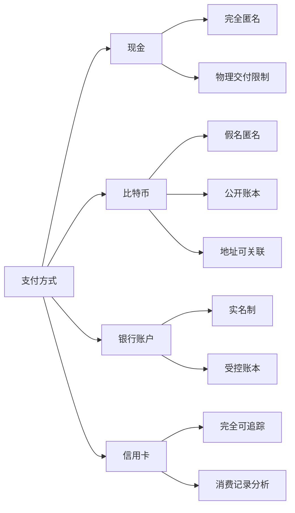
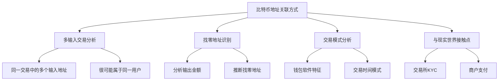
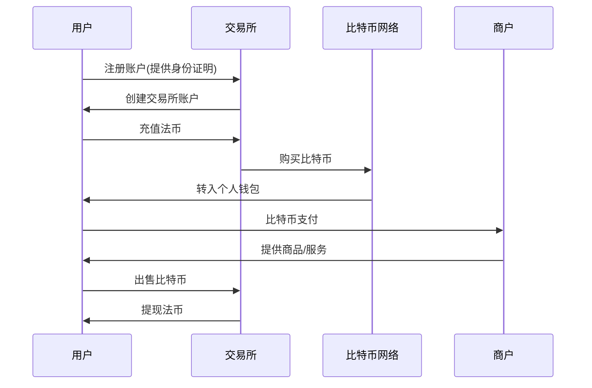
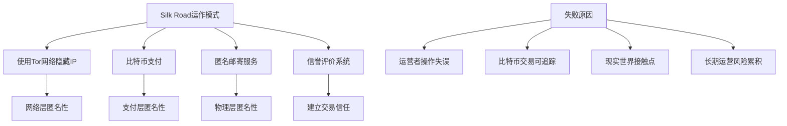
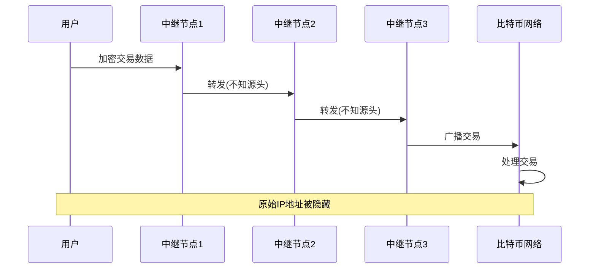
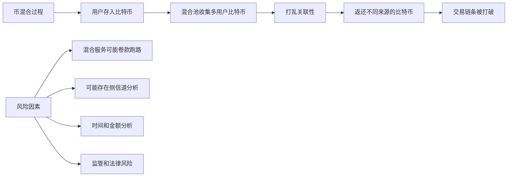
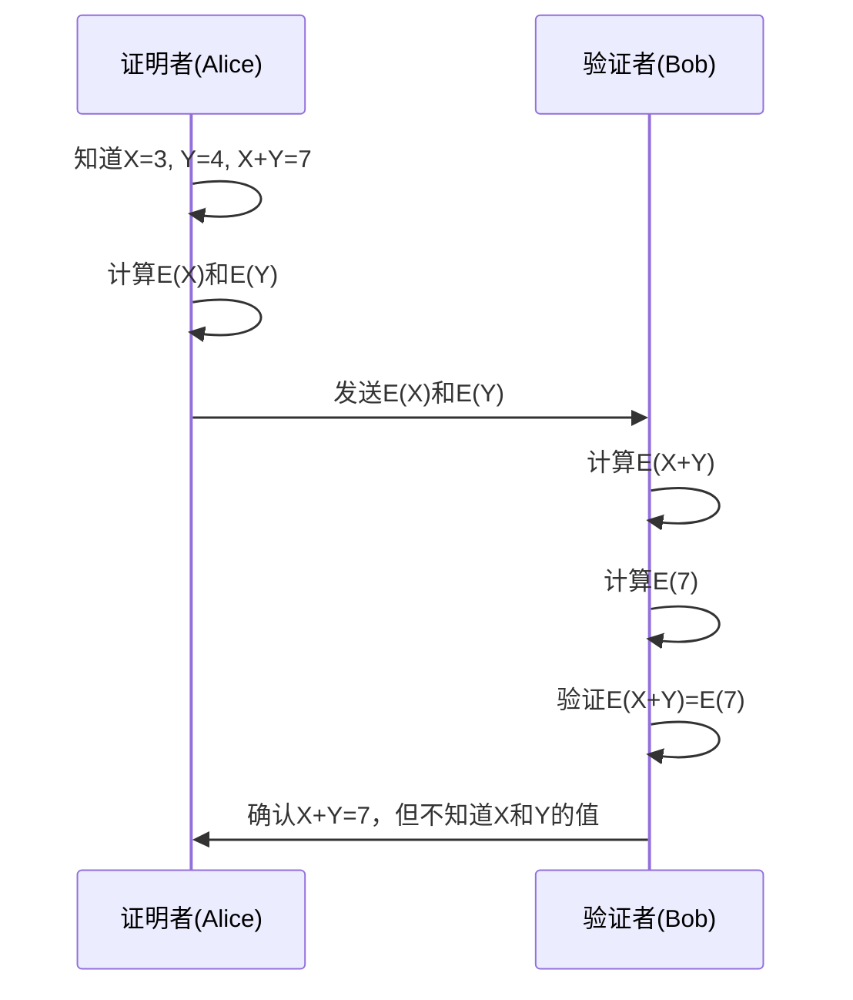
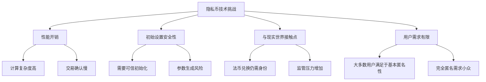

**12-BTC-匿名性优化版 (Av37065233, P12)**

## 比特币匿名性概述

本章探讨比特币系统的匿名性特征，分析其优势与局限，并介绍相关的隐私保护技术。

### 匿名性的定义与级别

匿名性通常与隐私保护（Privacy）密切相关，指的是用户在进行交易时不必暴露真实身份的能力。比特币提供了一定程度的匿名性，但这种匿名性存在明显局限。

#### 匿名性级别对比表

| 支付方式 | 匿名性级别 | 身份要求 | 交易追踪难度 |
|----------|------------|----------|--------------|
| **现金** | ⭐⭐⭐⭐⭐ | 无身份要求 | 几乎不可追踪 |
| **比特币** | ⭐⭐⭐☆☆ | 使用假名(公钥哈希) | 可通过区块链分析追踪 |
| **银行账户(实名)** | ⭐☆☆☆☆ | 需实名认证 | 易于追踪 |
| **银行账户(匿名)** | ⭐⭐⭐☆☆ | 历史上曾允许匿名 | 取款需实体接触 |
| **信用卡** | ⭐☆☆☆☆ | 需实名认证 | 完全可追踪 |

**比特币匿名性特点**：
- 使用的是"假名匿名"(Pseudonymity)而非完全匿名
- 用户可以创建任意多个地址而无需实名认证
- 类似于作家使用笔名或网民使用网名
- 不需要提供真实身份信息即可参与系统

**知识补充**：
- 完全匿名(True Anonymity)与假名匿名(Pseudonymity)是两个不同概念
- 完全匿名指无法将行为与任何身份关联
- 假名匿名指使用假名代替真实身份，但假名本身可能被追踪

### 比特币与其他支付方式的匿名性比较

#### 与现金对比

**现金优势**：
- 完全匿名，无需任何身份信息
- 没有交易记录
- 无法远程追踪

**现金劣势**：
- 保管和运输不便
- 不适合大额远距离交易
- 容易丢失

#### 与银行账户对比

**银行账户特点**：
- 现代银行系统普遍实行实名制
- 历史上曾允许使用化名开户（无需身份证）
- 银行账本是受控的，非公开
- 取款需要实体接触（柜台或ATM）

**比较分析**：
- 比特币账本完全公开，任何人可查看
- 银行账本仅对内部和授权机构开放
- 从隐私角度看，银行账户在某些方面可能优于比特币

## 比特币匿名性的局限

### 地址关联问题

比特币用户可以创建多个地址，理论上增强匿名性。然而，这些不同地址往往可以通过交易分析被关联起来。

#### 地址关联的主要方式

#### 多输入交易分析示例

| 交易组件 | 地址 | 金额 | 关联推断 |
|----------|------|------|----------|
| **输入1** | 地址A | 4 BTC | 同一用户控制 |
| **输入2** | 地址B | 5 BTC | 同一用户控制 |
| **输出1** | 地址C | 6 BTC | 可能是收款方 |
| **输出2** | 地址D | 3 BTC | 可能是找零地址 |

**地址关联分析**：
- 地址A和地址B很可能属于同一用户（需同时控制私钥）
- 通过金额分析可推断地址D为找零地址
- 如果地址C是商家地址，则交易目的可能被识别

**知识补充**：
- 大多数比特币交易由钱包软件自动生成
- 不同钱包软件有不同的交易生成模式
- 通过分析这些模式，可以进一步关联地址
- HD钱包(分层确定性钱包)虽生成多个地址，但这些地址仍可被关联

### 与现实世界的接触点

比特币匿名性最大的挑战是与现实世界的接触点，这些接触点往往会泄露用户身份。

#### 身份泄露的主要接触点

| 接触点类型 | 泄露风险 | 对匿名性的影响 | 防护难度 |
|------------|----------|----------------|----------|
| **资金转入转出** | 🔴 极高 | 直接关联实名身份 | 非常困难 |
| **交易所KYC** | 🔴 极高 | 完全暴露身份 | 无法避免 |
| **商户支付** | 🟠 高 | 可能泄露身份 | 困难 |
| **IP地址追踪** | 🟠 高 | 可能定位用户 | 可通过技术解决 |
| **交易模式分析** | 🟡 中等 | 间接关联身份 | 需要专业知识 |

#### 资金转入转出分析

**资金转入转出的风险**：
- 交易所通常需要KYC(了解你的客户)验证
- 大额资金流动会引起监管关注
- 反洗钱法规要求追踪资金来源
- 场外交易(OTC)也可能泄露身份

**商户支付的风险**：
- 实体店支付会暴露物理位置
- 网购需要提供收货地址
- 支付时间与位置可用于身份关联
- 周围人可能观察到支付地址

**知识补充**：
- 信用卡匿名化研究表明，即使删除个人信息，仅凭几次交易也能定位用户
- 比特币交易的公开性使这一问题更加严重
- 即使采取预防措施，频繁使用同一地址进行支付也会泄露身份

## 匿名性维护的成功与失败案例

### 中本聪的匿名性维护

中本聪是比特币的创始人，也是维护匿名性最成功的例子。尽管参与比特币项目最早且时间最长，至今没有人确切知道他的真实身份。

#### 中本聪匿名性维护策略分析

| 策略 | 具体做法 | 效果 |
|------|----------|------|
| **避免资金流动** | 从未移动早期挖矿所得比特币 | 极其有效 |
| **功成身退** | 项目稳定后完全消失 | 减少身份线索 |
| **技术交流限制** | 仅通过邮件和论坛交流 | 减少个人特征泄露 |
| **避免个人信息** | 不透露个人背景和地理位置 | 增加追踪难度 |

**中本聪比特币**：
- 据估计拥有约100万枚比特币
- 当前价值数百亿美元
- 这些比特币从未被移动过
- 移动这些比特币将极大增加身份暴露风险

**知识补充**：
- 中本聪的匿名性成功关键在于从未将比特币转换为法币
- 这表明其创建比特币可能不是为了金钱利益
- 而是出于理念或技术理想主义

### Silk Road(丝路)案例

Silk Road是一个曾经的暗网市场，主要交易违禁品，使用比特币作为支付手段，试图利用比特币的匿名性逃避执法机构追踪。

**Silk Road案例结果**：
- 运行约2-3年后被美国执法机构查封
- 创始人Ross Ulbricht在旧金山被捕
- 美国政府缴获约17万枚比特币
- 创始人获刑终身监禁

**匿名性失败原因**：
- 操作安全失误(使用同一设备登录真实身份和Silk Road管理员账户)
- 长期运营增加了被发现的风险
- 大量比特币积累但无法安全变现
- 比特币交易的可追踪性被低估

**知识补充**：
- Silk Road被查封后，出现了Silk Road 2.0等类似网站
- 这些网站最终也都被执法机构关闭
- 这表明仅依靠比特币的匿名性从事非法活动是不可持续的
- 所有已知的大规模非法比特币使用案例最终都被执法机构追踪

## 增强比特币匿名性的技术

为了增强比特币的匿名性，研究人员和开发者提出了多种技术方案，从网络层和应用层两个维度入手。

### 网络层匿名性增强

**网络层匿名性技术**：
- Tor(洋葱路由)：多层加密转发
- I2P(隐形互联网协议)：端到端加密通信
- 多路径转发：通过多个节点传递交易
- VPN：隐藏原始IP地址

**工作原理**：
- 交易不直接从用户发送到比特币网络
- 而是通过多个中继节点转发
- 每个节点只知道上一个节点和下一个节点
- 只要路径中有一个诚实节点，发送者身份就能保持隐秘

**知识补充**：
- 网络层匿名性技术在比特币出现前已经发展成熟
- 这些技术可以有效防止IP地址追踪
- 但不能解决区块链交易本身的可追踪性问题

### 应用层匿名性增强

#### 币混合(Coin Mixing)技术

| 币混合方法 | 工作原理 | 优势 | 劣势 |
|------------|----------|------|------|
| **专业混币服务** | 多用户比特币集中混合后重新分配 | 打破交易链条 | 需信任第三方 |
| **CoinJoin** | 多方协作创建单一交易 | 无需信任中心方 | 需要多方同时在线 |
| **交易所间接混合** | 通过交易所存取和币种转换 | 自然混合过程 | 交易所可能记录信息 |
| **在线钱包** | 多用户资金池管理 | 便于使用 | 钱包方可能记录信息 |

**币混合挑战**：
- 信任问题：混币服务可能不可靠
- 侧信道分析：通过金额和时间可能重建关联
- 交易费用：混币通常需要支付额外费用
- 法律问题：某些司法管辖区可能限制混币服务

**知识补充**：
- 币混合技术是比特币生态系统中的隐私保护层
- 不同混合技术提供不同级别的隐私和便利性
- 完美的混合需要注意金额、时间和交易模式
- 混合后仍需谨慎使用，避免重新建立关联

## 零知识证明与高级隐私币

### 零知识证明基础

零知识证明是一种密码学技术，允许一方(证明者)向另一方(验证者)证明某个陈述是正确的，而无需透露除了该陈述正确性之外的任何信息。

#### 零知识证明的三个特性

| 特性 | 描述 | 意义 |
|------|------|------|
| **完备性** | 如果陈述为真，诚实的验证者会被说服 | 确保真实信息能被接受 |
| **可靠性** | 如果陈述为假，任何证明者都无法说服验证者 | 防止虚假信息被接受 |
| **零知识性** | 验证者除了陈述正确外不获得任何额外信息 | 保护证明者隐私 |

**同态隐藏特性**：
1. 无碰撞性：不同输入产生不同加密值
2. 不可逆性：从加密值无法推导原始输入
3. 同态运算：加密值的运算等价于原值运算后再加密

**零知识证明示例**：
- Alice知道两个数X和Y，且X+Y=7
- Alice需要向Bob证明这一点，但不透露X和Y的具体值
- 通过同态加密函数E，Alice发送E(X)和E(Y)给Bob
- Bob可以验证E(X+Y)=E(7)，但无法知道X和Y的值

**知识补充**：
- 零知识证明在区块链领域有广泛应用
- 可用于证明交易有效性而不泄露交易细节
- 高级实现包括zk-SNARKs和zk-STARKs
- 计算复杂度是实际应用的主要挑战

### 高级隐私币：Zerocoin和Zcash

基于零知识证明技术，研究人员开发了专门为匿名性设计的加密货币，如Zerocoin和Zcash。

#### Zerocoin与Zcash对比

| 特征 | Zerocoin | Zcash | 比特币 |
|------|----------|-------|--------|
| **匿名性级别** | 高 | 非常高 | 中等 |
| **技术基础** | 零知识证明 | zk-SNARKs | UTXO模型 |
| **交易追踪** | 不可追踪 | 完全隐私 | 可追踪 |
| **性能开销** | 较高 | 高 | 低 |
| **采用程度** | 有限 | 中等 | 广泛 |

**Zerocoin工作原理**：
- 基于基础币(如比特币)构建
- 用户将基础币转换为Zerocoin
- 使用零知识证明证明持有合法的Zerocoin
- 无需揭示具体是哪个Zerocoin被使用

**Zcash工作原理**：
- 完全独立的加密货币
- 使用zk-SNARKs实现完全隐私交易
- 支持透明地址和隐私地址
- 交易金额、发送方和接收方都可以隐藏

**高级隐私币的局限性**：
- 性能损失：隐私保护需要更多计算资源
- 初始化风险：需要安全的参数生成过程
- 与现实世界接触点仍是隐私泄露风险
- 用户群体有限：完全匿名需求相对小众
- 监管压力：完全匿名引发监管担忧

**知识补充**：
- 尽管技术上提供了强大的隐私保护，这些隐私币仍未成为主流
- 区块链的不可篡改性对隐私保护是"双刃剑"
- 一旦隐私泄露，记录将永久保存在区块链上
- 真正的隐私保护需要从系统设计初始就考虑

## 总结与思考

比特币提供了一定程度的假名匿名性，但这种匿名性存在明显局限。通过区块链分析，不同地址可以被关联，而与现实世界的接触点则可能完全暴露用户身份。

增强比特币匿名性的技术从网络层和应用层两个维度入手，包括使用Tor网络、币混合服务等。更先进的方案如Zerocoin和Zcash则基于零知识证明技术，从设计上提供更强的隐私保护。

然而，无论技术多么先进，与现实世界的接触点仍然是隐私保护的最大挑战。历史经验表明，仅依靠加密货币的匿名性从事非法活动最终都会被执法机构追踪。真正的隐私保护需要全方位的安全意识和谨慎操作。

对于普通用户而言，比特币现有的匿名性已经足够保护基本隐私，而完全匿名的需求相对小众。这也解释了为何专门为匿名性设计的加密货币至今仍未成为主流。
