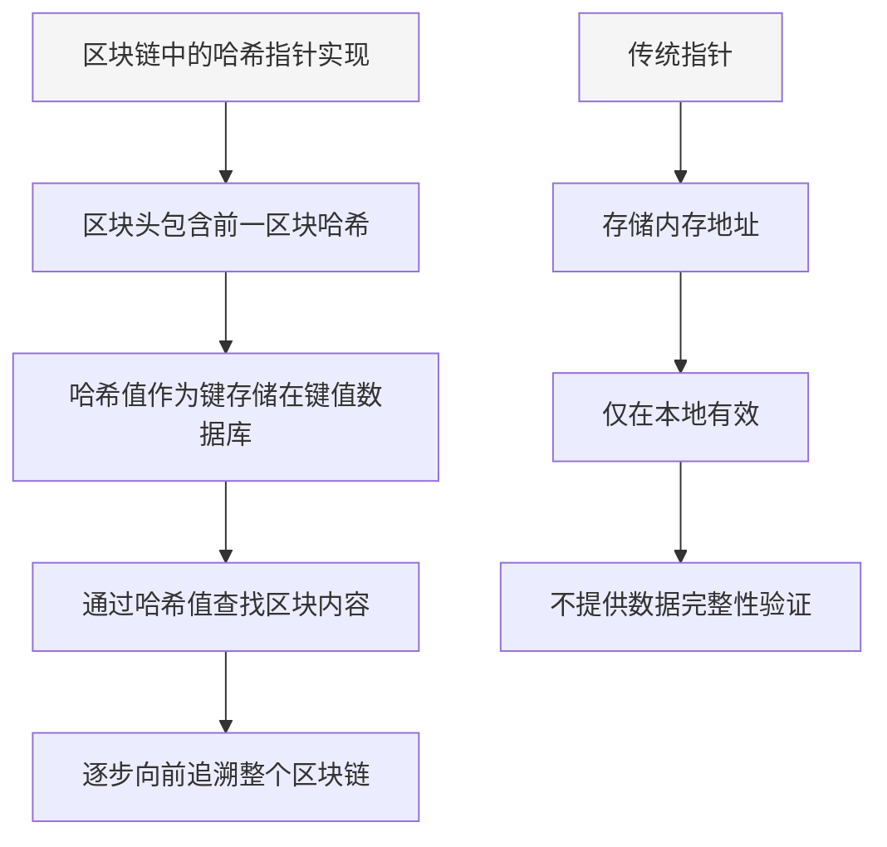
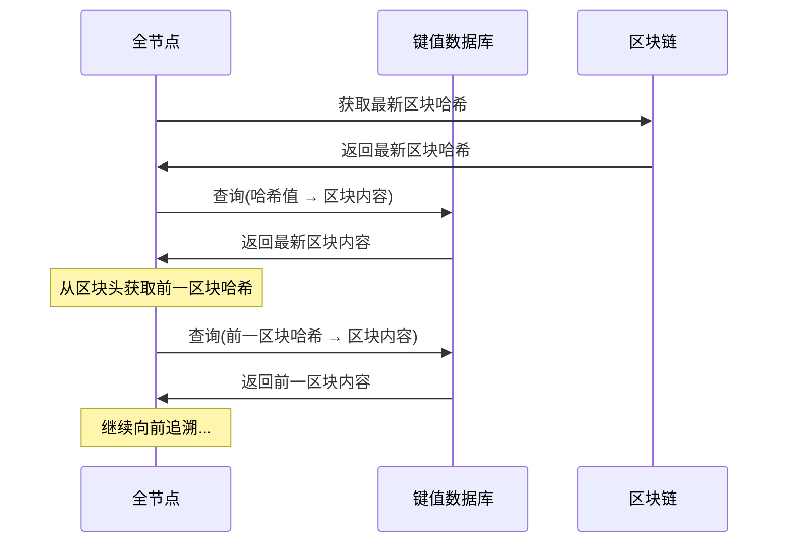
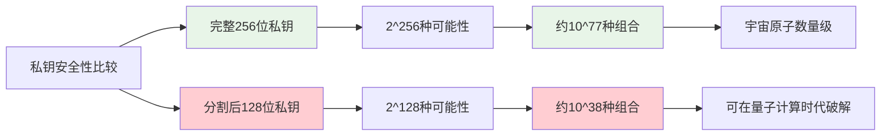
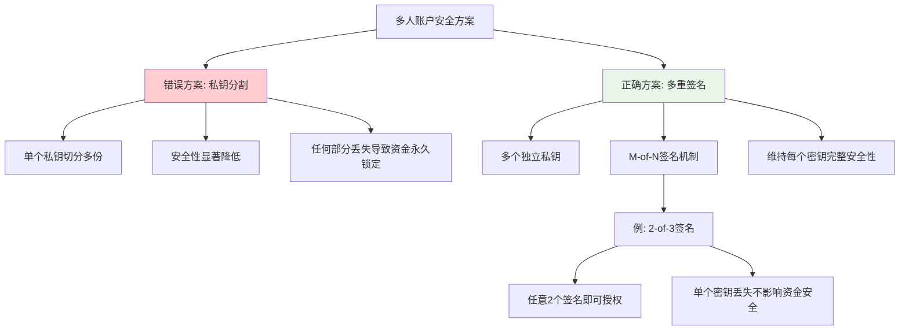
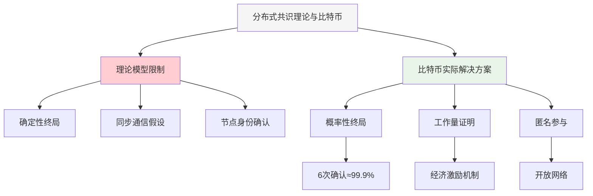
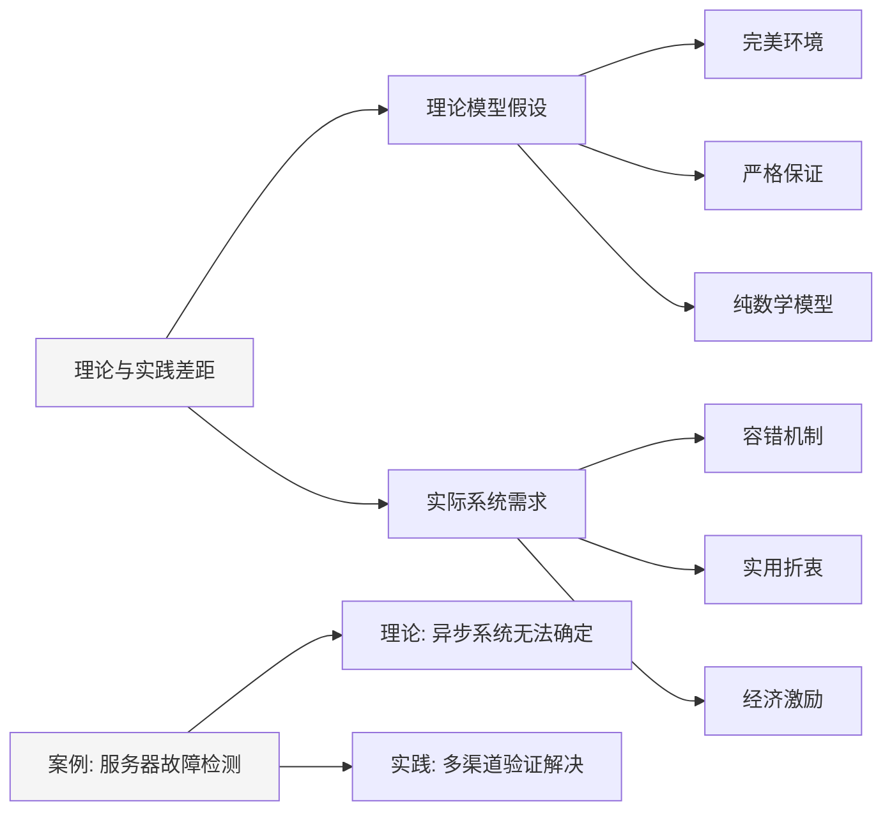
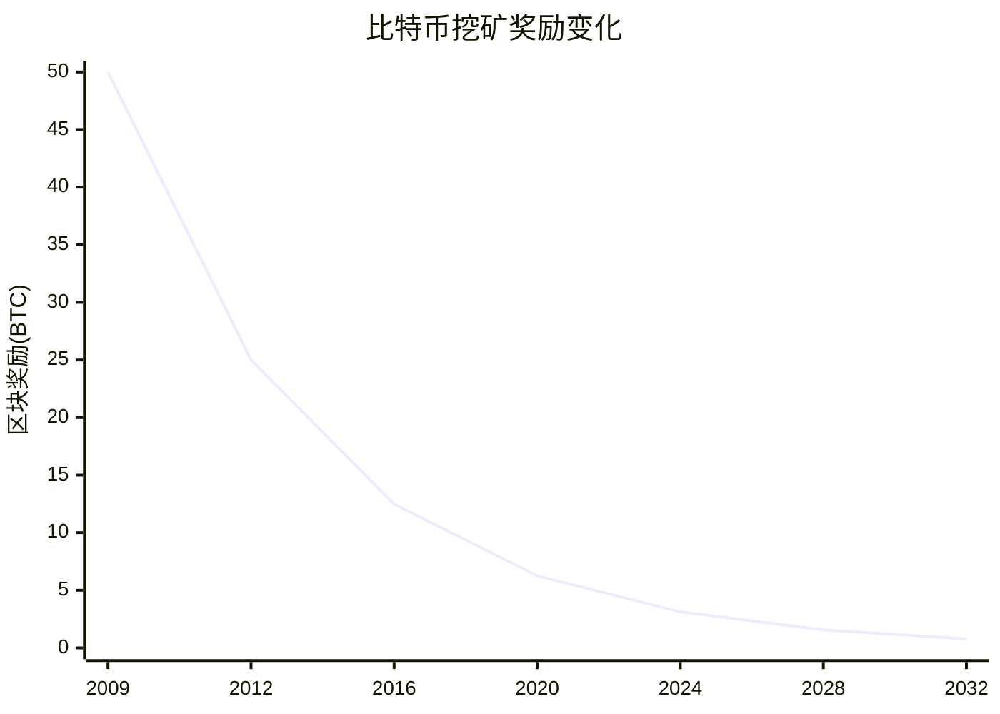
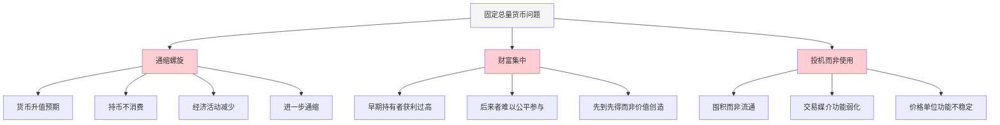
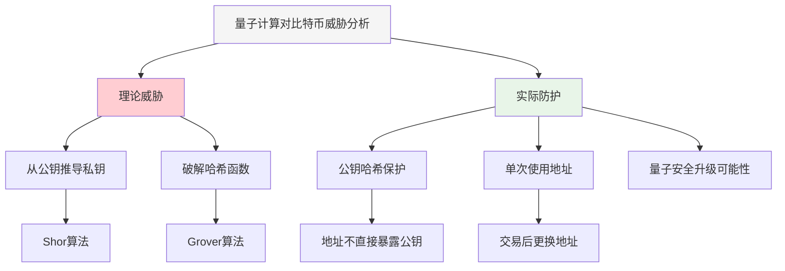
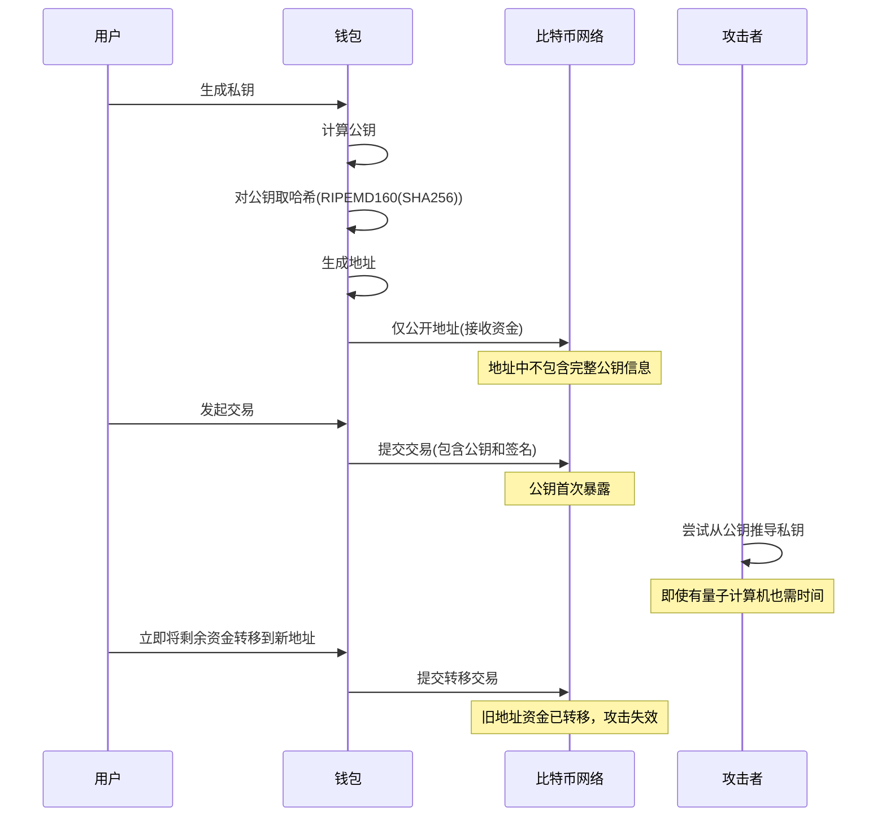

**13-BTC-思考优化版 (Av37065233, P13)**

## 比特币系统设计思考

本章对比特币系统的设计进行深入思考，探讨其技术实现中的关键细节、潜在问题和未来挑战，帮助读者更全面地理解区块链技术。

### 哈希指针的实际实现

哈希指针是比特币系统中广泛使用的一个概念，但其实际实现与传统编程中的指针有很大不同。

#### 哈希指针与传统指针的对比

| 特性 | 传统指针 | 哈希指针 | 区别 |
|------|----------|----------|------|
| **存储内容** | 内存地址 | 哈希值 | 完全不同的引用方式 |
| **作用范围** | 本地内存 | 全网分布式 | 跨网络可用 |
| **不可变性** | 可修改 | 防篡改 | 提供数据完整性 |
| **查找方式** | 直接访问 | 键值查询 | 通过数据库查找 |
| **空间占用** | 4-8字节 | 32字节(SHA-256) | 哈希指针更大 |

**实际实现细节**：
- 比特币系统中的"哈希指针"实际上只有哈希值，没有传统意义上的指针
- 区块头中包含前一个区块的哈希值，而非内存地址
- 全节点通常使用键值数据库(如LevelDB)存储区块数据
- 哈希值作为键(Key)，区块内容作为值(Value)
- 通过哈希值查找对应区块内容，实现链式结构

#### 区块链数据存储架构

**知识补充**：
- LevelDB是比特币核心客户端使用的键值数据库
- 轻节点不保存完整区块链，只保存最近几千个区块
- 需要更早区块信息时，可向其他全节点请求
- 哈希指针的设计保证了区块链的不可篡改性
- 修改任何区块内容都会导致哈希值变化，破坏链式结构

### 区块链与私钥安全

"区块链"是一个流行但存在误解的概念，尤其是关于私钥安全的处理方式。

#### 私钥分割的安全隐患

| 安全方案 | 实现方式 | 安全性评估 | 风险等级 |
|----------|----------|------------|----------|
| **私钥分割** | 将私钥分成多份 | 显著降低安全性 | 🔴 高风险 |
| **多重签名** | 多个独立私钥 | 维持或提高安全性 | 🟢 安全 |
| **门限签名** | 密码学分割方案 | 维持安全性 | 🟢 安全 |
| **单一私钥** | 一人完全控制 | 单点故障风险 | 🟠 中等风险 |

**私钥分割的数学问题**：
- 256位私钥分割为两个128位部分
- 攻击者已知一半，只需破解另一半
- 破解难度从2^256降至2^128
- 安全性降低程度远超50%

**多人账户的安全风险**：
- 四人共享账户，每人持有1/4私钥
- 三人合谋时只需破解剩余1/4(64位)
- 2^64约等于1.8×10^19，现代计算机可破解
- 安全性与人数成反比，人越多越不安全

#### 多重签名解决方案

**多重签名优势**：
- 每个私钥都是独立生成的完整私钥
- 可设置M-of-N阈值(如3人中任意2人签名有效)
- 单个私钥丢失不会导致资金永久锁定
- 提供灵活的安全与便利性平衡

**知识补充**：
- 比特币脚本支持多重签名操作
- 现代钱包通常提供多重签名功能
- 企业级应用常用多重签名增强安全性
- "死币"问题会导致UTXO集合永久膨胀
- 早期比特币中约有300-400万枚因私钥丢失而永久锁定

### 分布式共识的理论与实践

分布式系统理论中存在多个"不可能结论"(Impossibility Results)，但比特币系统似乎绕过了这些限制。

#### 分布式共识理论与比特币实践对比

| 理论结论 | 传统要求 | 比特币实现 | 差异分析 |
|----------|----------|------------|----------|
| **FLP不可能性** | 异步系统无法达成确定性共识 | 概率性共识 | 放宽确定性要求 |
| **CAP定理** | 一致性、可用性、分区容忍性不可兼得 | 最终一致性 | 接受临时不一致 |
| **拜占庭将军问题** | 需要2f+1个诚实节点 | 基于算力而非节点数 | 改变信任基础 |
| **共识不可撤销性** | 一旦达成共识不可更改 | 允许区块链重组 | 接受概率性终局 |

**比特币共识的特殊性**：
- 比特币并未实现严格意义上的分布式共识
- 区块确认是概率性的，而非确定性的
- 任何区块都有可能被回滚(概率随确认数增加而降低)
- 理论上可能回滚至创世区块(实际概率极低)

#### 理论与实践的差距

**知识补充**：
- FLP不可能性定理(Fischer, Lynch, Paterson, 1985)证明在异步系统中不存在确定性共识算法
- 比特币通过概率性共识和经济激励机制绕过了理论限制
- 理论模型通常基于特定假设，改变假设可能使"不可能"变为"可能"
- 实际系统设计需要在理论纯粹性和实用性之间寻找平衡

### 比特币的稀缺性设计

比特币的稀缺性设计是其经济模型的核心，但这种设计是否适合作为货币存在争议。

#### 比特币与传统货币特性对比

| 特性 | 比特币 | 法定货币 | 黄金 | 影响分析 |
|------|--------|----------|------|----------|
| **总量** | 固定2100万枚 | 可无限发行 | 有限但可增加 | 比特币最稀缺 |
| **增发机制** | 固定算法，定期减半 | 中央银行决策 | 开采新矿 | 比特币最可预测 |
| **通胀性** | 通缩性质 | 通胀性质 | 弱通缩性质 | 比特币价值长期看涨 |
| **财富分配** | 早期获取者优势明显 | 相对均衡 | 拥有者优势 | 比特币"先到先得" |
| **价格稳定性** | 波动剧烈 | 相对稳定 | 中等波动 | 比特币最不稳定 |

**比特币挖矿奖励机制**：
- 初始区块奖励50 BTC
- 每210,000个区块(约4年)减半一次
- 当前奖励6.25 BTC(2020-2024)
- 总量约2100万枚(实际略少)
- 最后一枚比特币预计在2140年左右被挖出

#### 固定总量货币的经济问题

**黄金标准的历史教训**：
- 大多数国家已放弃金本位制
- 固定供应量无法匹配经济增长
- 导致通缩压力和经济不稳定
- 财富向早期持有者集中

**知识补充**：
- 健康的货币系统需要适度的通货膨胀
- 以太坊等新一代加密货币采用不同的发行机制
- 一些加密货币设计了自动通胀机制
- 通胀与通缩都需要适度，极端情况都会导致经济问题
- 货币的三大功能：交易媒介、价值存储、计价单位

### 量子计算与比特币安全

量子计算技术的发展引发了对比特币等加密货币安全性的担忧，但这种担忧需要理性分析。

#### 量子计算对不同密码系统的威胁程度

| 密码系统 | 量子计算威胁 | 原因 | 对策 |
|----------|--------------|------|------|
| **对称加密** | 🟠 中等 | Grover算法可加速破解 | 增加密钥长度 |
| **RSA/ECC** | 🔴 严重 | Shor算法可有效破解 | 需更换算法 |
| **哈希函数** | 🟢 有限 | 量子优势有限 | 增加哈希长度 |
| **比特币地址** | 🟢 有限 | 多层保护机制 | 使用未用过的地址 |
| **传统金融系统** | 🔴 严重 | 大量依赖RSA/ECC | 需全面升级 |

#### 比特币地址的多层保护

**比特币对量子计算的抵抗力**：
- 比特币地址是公钥的哈希值，不是公钥本身
- 公钥只有在花费资金时才首次暴露
- 量子计算机需要时间从公钥推导私钥
- 一次性使用地址可有效防范量子计算威胁
- 哈希函数对量子计算的抵抗力强于非对称加密

**知识补充**：
- Shor算法(1994)可有效破解RSA等非对称加密
- Grover算法可将哈希函数破解速度从O(2^n)降至O(2^(n/2))
- 实用量子计算机仍面临巨大技术挑战
- 传统金融系统同样面临量子计算威胁
- 量子安全密码学(Post-Quantum Cryptography)正在发展
- 比特币协议可通过软分叉升级采用量子安全算法

## 总结与展望

比特币系统的设计包含许多精妙之处，也存在一些值得思考的问题。通过深入理解哈希指针的实际实现、私钥安全的正确方法、分布式共识的理论与实践差距、货币稀缺性的经济影响以及量子计算的安全挑战，我们可以更全面地认识区块链技术的本质。

区块链技术仍处于发展初期，未来将继续演化。关键是要保持开放思维，不被既有理论局限，也不盲目追随技术热点，而是基于实际需求和科学分析做出合理决策。正如本章所强调的，理论与实践之间常存在差距，突破这种差距往往能带来创新。

比特币作为第一代区块链系统，为后续技术发展奠定了基础，也留下了许多值得改进的空间。以太坊等新一代区块链系统在比特币的基础上进行了诸多创新，这种不断演进的过程将推动整个行业走向更加成熟。
