**22-ETH-智能合约优化版 (Av37065233, P22)**

## 智能合约概述

智能合约是以太坊的精髓，也是以太坊和比特币的最大区别。智能合约的本质是运行在区块链上的一段代码，这段代码的逻辑定义了合约的内容。

### 智能合约的核心特征

| 特征 | 说明 | 重要性 |
|------|------|--------|
| **本质** | 运行在区块链上的代码 | 🔴 核心概念 |
| **状态存储** | 账户里保存当前运行状态 | 🔴 关键功能 |
| **编程语言** | 主要使用Solidity语言 | 🟡 技术实现 |
| **不可篡改** | 一旦部署无法修改 | 🔴 安全特性 |
| **自动执行** | 满足条件时自动触发 | 🟡 运行机制 |

### 合约状态组成

智能合约的账户状态包括以下几项：
- 当前余额
- 交易次数
- 合约代码
- 存储(使用MPT数据结构)

## Solidity语言基础

Solidity是以太坊智能合约的主要编程语言，语法上与JavaScript相近。熟悉JavaScript的开发者学习Solidity会相对容易。

### Solidity代码结构示例

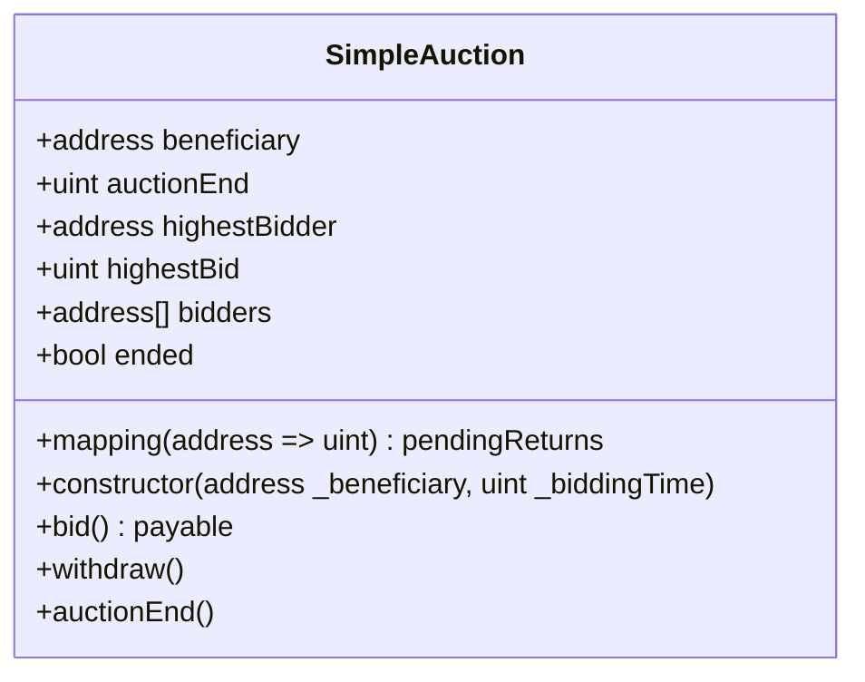

### Solidity语言特点

| 特点 | 描述 | 与传统语言对比 |
|------|------|----------------|
| **版本声明** | 需明确指定使用的版本号 | 避免不同版本语法差异 |
| **面向对象** | 使用contract类似于class | 与C++/Java类似 |
| **强类型** | 变量需明确声明类型 | 类似C++，不同于JavaScript |
| **特殊类型** | 包含address等区块链特有类型 | 区别于传统语言 |
| **事件机制** | 使用event记录日志 | 类似于观察者模式 |
| **哈希表限制** | mapping不支持遍历 | 需额外记录键列表 |
| **数组支持** | 支持固定长度和动态数组 | 类似大多数语言 |

#### 知识点补充：Solidity数据类型

Solidity提供了多种数据类型，包括：

1. **值类型**：
   - 布尔型(bool)
   - 整型(int/uint，8到256位)
   - 地址型(address)
   - 定点数(fixed/ufixed)
   - 字节数组(bytes1到bytes32)
   - 枚举(enum)

2. **引用类型**：
   - 数组(array)
   - 结构体(struct)
   - 映射(mapping)

3. **特殊类型**：
   - 函数类型(function)
   - 合约类型(contract)

## 智能合约调用机制

智能合约的调用本质上是一种特殊的转账交易。

### 合约调用与普通转账对比

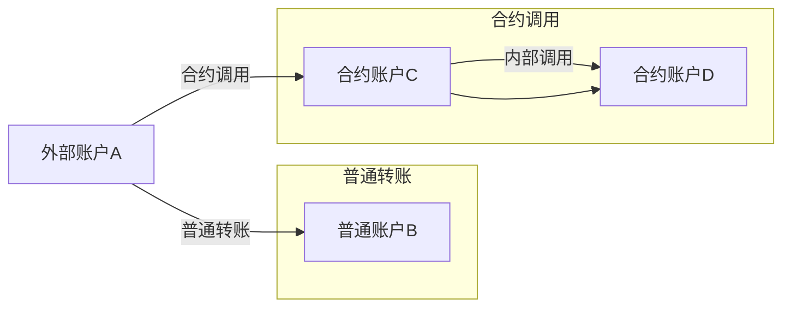

### 调用数据结构

调用智能合约时，交易包含以下关键信息：

| 字段 | 说明 | 示例 |
|------|------|------|
| **from** | 发起调用的账户地址 | 0x123... |
| **to** | 被调用的合约地址 | 0x456... |
| **value** | 转账金额(以wei为单位) | 0 |
| **data** | 调用的函数及参数 | 0xabcd... |
| **gas used** | 消耗的汽油费 | 21000 |
| **gas price** | 单位汽油的价格 | 20 Gwei |
| **gas limit** | 最多愿意支付的汽油量 | 100000 |

## 合约间调用方式

除了外部账户调用合约，合约也可以调用其他合约函数。

### 三种主要调用方式

#### 1. 直接调用

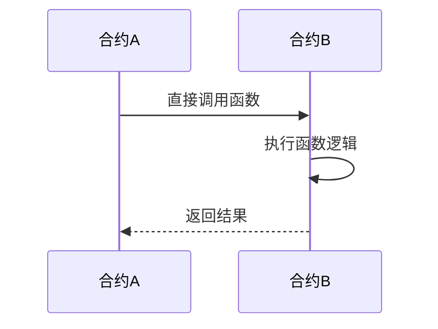

**特点**：
- 语法简洁明了
- 错误会导致连锁回滚
- 需要导入被调用合约的接口

#### 2. 低级调用(call)

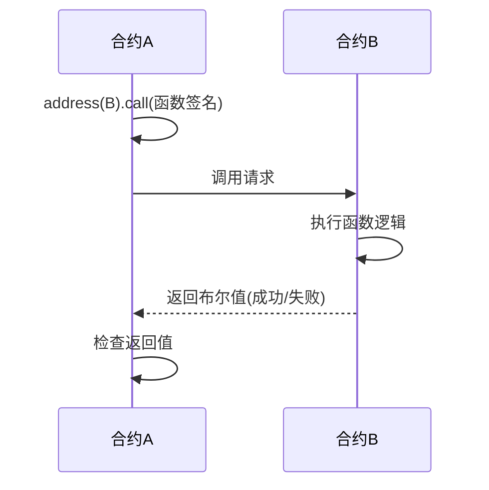

**特点**：
- 调用失败不会导致整个交易回滚
- 返回布尔值表示成功或失败
- 可以继续执行后续代码

#### 3. 委托调用(delegatecall)

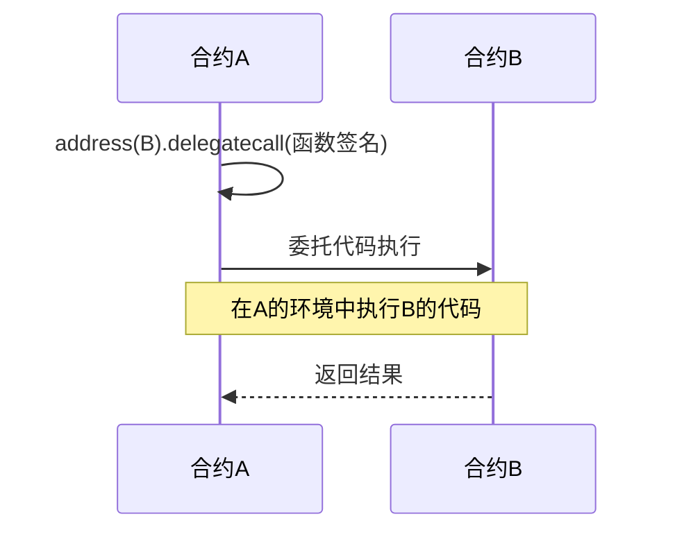

**特点**：
- 在调用者的环境中执行被调用合约的代码
- 使用调用者的存储、余额等状态
- 主要用于实现可升级合约和库合约

#### 知识点补充：调用方式比较表

| 调用方式 | 执行环境 | 错误处理 | 状态变更 | 主要用途 |
|----------|----------|----------|----------|----------|
| **直接调用** | 被调用合约 | 连锁回滚 | 被调用合约状态 | 标准合约交互 |
| **call** | 被调用合约 | 返回布尔值 | 被调用合约状态 | 安全交互/转账 |
| **delegatecall** | 调用者合约 | 返回布尔值 | 调用者合约状态 | 代理模式/库 |

## Payable函数与转账机制

### Payable关键字

以太坊规定，如果合约账户要能接受外部转账，必须将函数标注为`payable`。

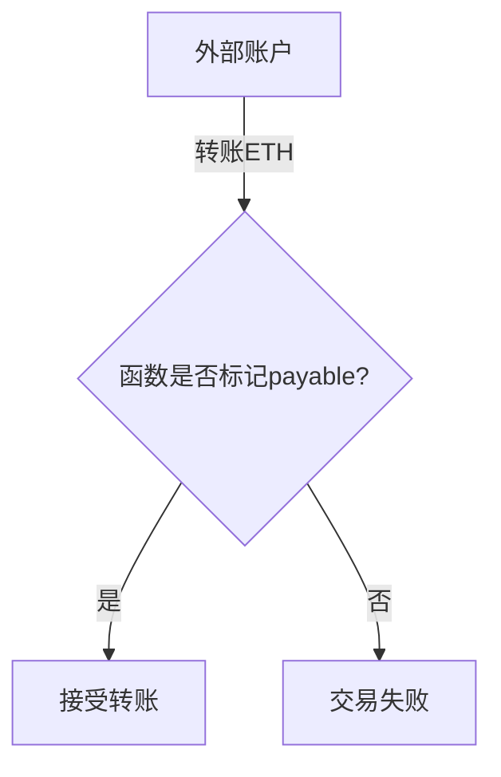

#### 函数类型与转账能力

| 函数类型 | 是否可接收ETH | 使用场景 |
|----------|--------------|----------|
| **payable函数** | ✅ 可以 | 需要接收资金的功能 |
| **非payable函数** | ❌ 不可以 | 纯逻辑操作 |
| **fallback函数(payable)** | ✅ 可以 | 接收无函数调用的转账 |
| **fallback函数(非payable)** | ❌ 不可以 | 处理未知函数调用 |

### Fallback函数

Fallback函数是一种特殊的匿名函数，在以下情况下会被调用：
- 向合约转账但未指定调用函数
- 调用的函数不存在于合约中

```
// Fallback函数定义
fallback() external payable {
    // 处理逻辑
}
```

#### 知识点补充：Receive函数(Solidity 0.6.0+)

在Solidity 0.6.0版本后，引入了专门的receive函数处理纯ETH转账：

```
// Receive函数定义
receive() external payable {
    // 处理纯ETH转账
}
```

当合约接收ETH时，调用优先级为：
1. 如果msg.data为空且有receive函数，调用receive
2. 如果没有receive函数或msg.data不为空，调用fallback

## 智能合约创建

智能合约的创建是通过特殊的交易实现的。

### 合约创建流程

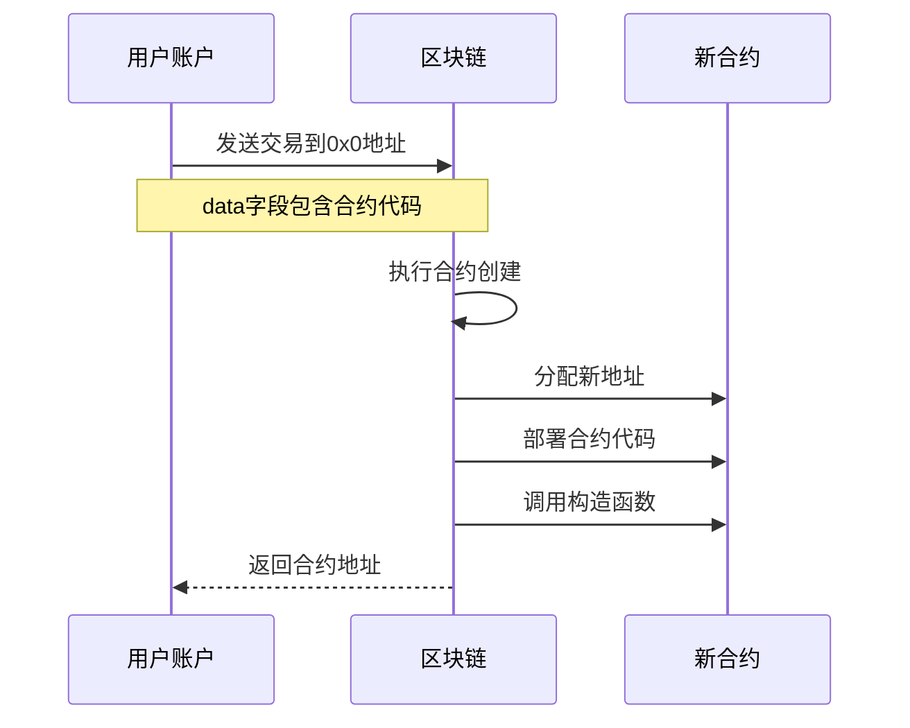

### 合约创建交易特点

| 特征 | 说明 |
|------|------|
| **接收地址** | 0x0(零地址) |
| **转账金额** | 通常为0 |
| **数据字段** | 包含编译后的合约字节码 |
| **执行环境** | EVM(以太坊虚拟机) |
| **返回结果** | 新创建的合约地址 |

## 以太坊虚拟机(EVM)

智能合约代码编译后运行在以太坊虚拟机(Ethereum Virtual Machine, EVM)上。

### EVM特点

| 特点 | 描述 | 意义 |
|------|------|------|
| **图灵完备** | 支持任意复杂度的计算 | 允许复杂应用开发 |
| **沙盒环境** | 隔离执行环境 | 提高安全性 |
| **确定性** | 相同输入产生相同输出 | 保证共识 |
| **256位架构** | 使用256位字长 | 适应密码学运算 |
| **全球计算机** | 所有节点运行相同代码 | "World Computer" |

#### 知识点补充：EVM与JVM对比

| 特性 | EVM | JVM |
|------|-----|-----|
| **设计目的** | 区块链智能合约执行 | 跨平台Java代码执行 |
| **执行模式** | 每个节点重复执行 | 单机执行 |
| **资源计费** | 按操作码收费(Gas) | 无内置计费机制 |
| **状态存储** | 全局状态树 | 本地内存/存储 |
| **确定性** | 严格确定性 | 允许非确定性 |
| **并发支持** | 不支持 | 支持多线程 |

## Gas机制

以太坊引入Gas机制解决图灵完备环境中的停机问题，并为资源使用定价。

### Gas机制工作原理

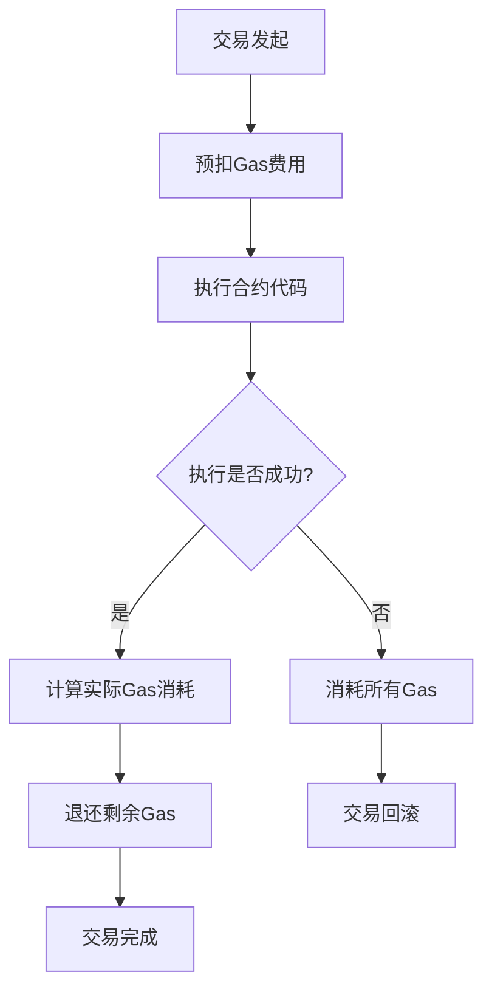

### Gas消耗规则

| 操作类型 | Gas消耗 | 示例 |
|----------|---------|------|
| **基本计算** | 低 | 加减法(3 Gas) |
| **存储操作** | 高 | 写入存储(20000 Gas) |
| **密码学操作** | 很高 | SHA3哈希(30 Gas) |
| **读取公共数据** | 免费/低 | 读取区块信息(2 Gas) |

### 交易Gas结构

| 字段 | 说明 | 作用 |
|------|------|------|
| **Gas Limit** | 愿意支付的最大Gas量 | 限制执行复杂度 |
| **Gas Price** | 单位Gas价格(Gwei) | 决定交易优先级 |
| **Gas Used** | 实际消耗的Gas量 | 计算最终费用 |

#### 知识点补充：区块Gas限制

区块头中也包含Gas相关字段：

| 字段 | 说明 | 特点 |
|------|------|------|
| **Gas Limit** | 区块内所有交易Gas上限 | 可由矿工微调 |
| **Gas Used** | 区块内所有交易消耗的Gas总和 | 不能超过Gas Limit |

以太坊区块Gas限制与比特币区块大小限制(1MB)的区别：
- 以太坊Gas限制可动态调整(每次±1/1024)
- 反映所有矿工的平均意见
- 更好地适应网络需求变化

## 错误处理机制

以太坊中的交易执行具有原子性，要么全部执行，要么完全不执行。

### 错误处理方法

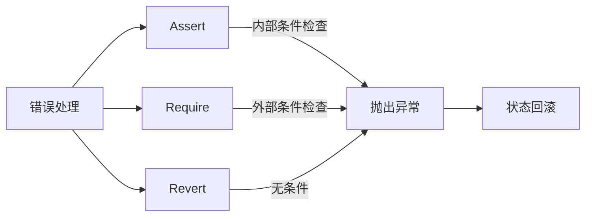

### 错误处理语句对比

| 语句 | 使用场景 | Gas消耗 | 错误信息 |
|------|----------|---------|----------|
| **assert()** | 内部不变量检查 | 消耗所有Gas | 不支持错误信息 |
| **require()** | 输入验证/前置条件 | 退还剩余Gas | 支持错误信息 |
| **revert()** | 复杂条件判断 | 退还剩余Gas | 支持错误信息 |

#### 示例代码

```
// 使用require检查拍卖是否结束
require(now <= auctionEnd, "拍卖已结束");

// 使用assert检查内部状态
assert(balance >= amount);

// 使用revert回滚交易
if (condition) {
    revert("操作失败");
}
```

#### 知识点补充：Solidity错误处理演进

Solidity早期版本使用throw进行错误处理，现已被弃用。新版本推荐使用：
- require()：输入验证
- assert()：内部一致性检查
- revert()：复杂条件判断

与许多现代语言不同，Solidity不支持try-catch结构(0.6.0版本前)。

## 连锁式回滚

当合约调用其他合约时，错误处理变得更加复杂。

### 连锁式回滚机制

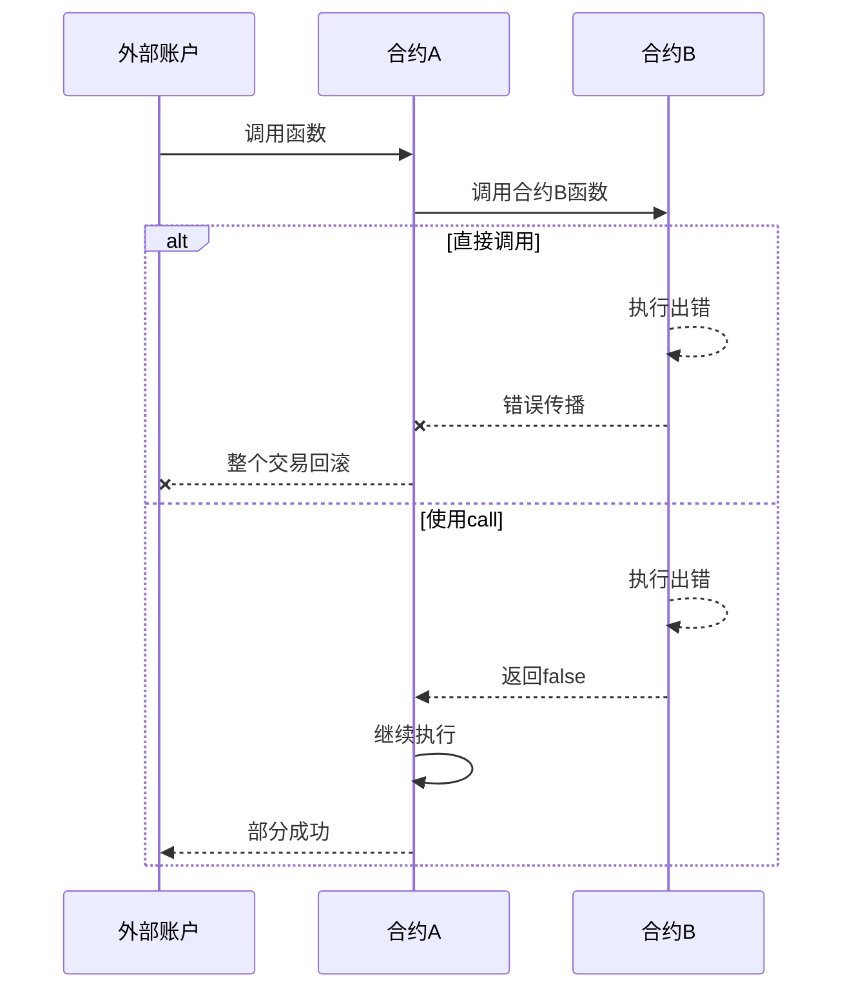

### 调用方式与错误传播

| 调用方式 | 错误传播 | 状态变化 |
|----------|----------|----------|
| **直接调用** | 连锁式回滚 | 全部回滚 |
| **address.call()** | 返回false | 部分执行 |
| **address.transfer()** | 连锁式回滚 | 全部回滚 |
| **address.send()** | 返回false | 部分执行 |

## 智能合约可访问信息

智能合约可以访问有限的区块链信息和调用信息。

### 可访问的区块信息

| 变量 | 描述 | 示例用途 |
|------|------|----------|
| **block.coinbase** | 当前区块矿工地址 | 奖励分配 |
| **block.difficulty** | 当前区块难度 | 随机数生成 |
| **block.gaslimit** | 当前区块gas限制 | 资源管理 |
| **block.number** | 当前区块高度 | 时间锁定 |
| **block.timestamp** | 当前区块时间戳 | 时间条件 |

### 可访问的调用信息

| 变量 | 描述 | 示例用途 |
|------|------|----------|
| **msg.sender** | 直接调用者地址 | 权限控制 |
| **msg.value** | 随调用发送的ETH | 支付功能 |
| **msg.data** | 完整调用数据 | 高级交互 |
| **msg.sig** | 函数标识符 | 函数路由 |
| **tx.origin** | 交易原始发起者 | 安全检查 |
| **msg.gas** | 剩余gas量 | 资源管理 |

#### 知识点补充：msg.sender vs tx.origin

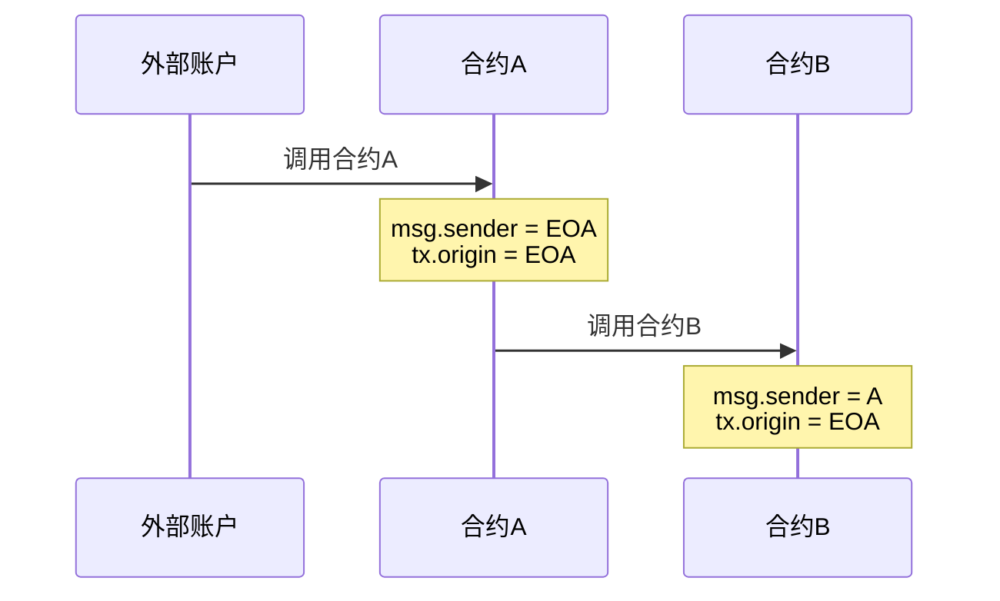

**安全提示**：避免使用tx.origin进行身份验证，容易受到钓鱼攻击。

## 地址类型及其成员

地址(address)是Solidity中的基本类型，表示20字节的以太坊地址。

### 地址类型成员

| 成员 | 类型 | 描述 |
|------|------|------|
| **balance** | uint256 | 地址余额(wei) |
| **transfer(amount)** | 函数 | 转账ETH，失败时回滚 |
| **send(amount)** | 函数 | 转账ETH，返回布尔值 |
| **call(data)** | 函数 | 低级调用，返回布尔值和数据 |
| **delegatecall(data)** | 函数 | 委托调用，保留上下文 |

### 转账方法对比

| 方法 | Gas限制 | 错误处理 | 推荐场景 |
|------|---------|----------|----------|
| **transfer()** | 2300 Gas | 失败时回滚 | 简单安全转账 |
| **send()** | 2300 Gas | 返回布尔值 | 需检查结果的转账 |
| **call{value:amount}()** | 无限制 | 返回布尔值 | 复杂交互/转账 |

```
// 使用transfer
payable(recipient).transfer(amount);

// 使用send
bool success = payable(recipient).send(amount);
require(success, "转账失败");

// 使用call
(bool success, ) = recipient.call{value: amount}("");
require(success, "转账失败");
```

## 智能合约安全问题案例

### 案例一：重入攻击

重入攻击是智能合约中最著名的安全漏洞之一。

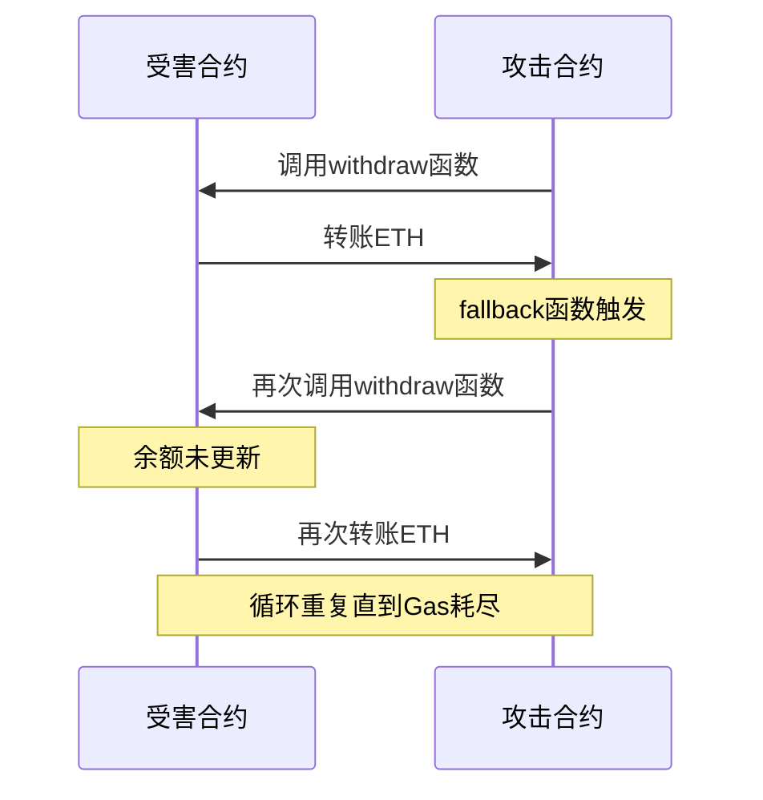

#### 漏洞代码

```
// 有漏洞的提款函数
function withdraw() public {
    uint amount = balances[msg.sender];
    (bool success, ) = msg.sender.call{value: amount}("");
    require(success, "转账失败");
    balances[msg.sender] = 0; // 转账后才更新余额
}
```

#### 修复方法

```
// 修复后的提款函数
function withdraw() public {
    uint amount = balances[msg.sender];
    balances[msg.sender] = 0; // 先更新余额
    (bool success, ) = msg.sender.call{value: amount}("");
    require(success, "转账失败");
}
```

### 案例二：无法接收ETH的合约

当合约需要接收ETH但没有正确实现接收函数时，会导致资金永久锁定。

#### 问题代码

```
// 没有fallback或receive函数的拍卖合约
contract SimpleAuction {
    // ... 其他代码
    
    function auctionEnd() public {
        // ... 拍卖结束逻辑
        
        // 退还竞拍者资金
        for (uint i = 0; i < bidders.length; i++) {
            address bidder = bidders[i];
            uint amount = pendingReturns[bidder];
            if (amount > 0) {
                pendingReturns[bidder] = 0;
                payable(bidder).transfer(amount); // 如果bidder是合约且没有接收函数，这里会失败
            }
        }
    }
}
```

#### 修复方法

```
// 修复后的退款方法
function withdraw() public {
    uint amount = pendingReturns[msg.sender];
    if (amount > 0) {
        pendingReturns[msg.sender] = 0;
        (bool success, ) = payable(msg.sender).call{value: amount}("");
        require(success, "转账失败");
    }
}
```

## 智能合约最佳实践

### 安全编码模式

| 模式 | 描述 | 目的 |
|------|------|------|
| **检查-效果-交互** | 先检查条件，再修改状态，最后与外部交互 | 防止重入攻击 |
| **拉取付款** | 让用户自己提取资金，而非主动发送 | 避免转账失败 |
| **限制访问** | 使用修饰符限制函数访问权限 | 防止未授权操作 |
| **紧急停止** | 实现暂停合约功能的机制 | 应对紧急情况 |

### 合约开发建议

1. **充分测试**：在测试网络上进行全面测试
2. **代码审计**：寻求专业安全团队审计
3. **形式化验证**：使用形式化方法验证合约逻辑
4. **模块化设计**：将复杂功能拆分为多个合约
5. **使用库**：利用经过验证的安全库
6. **保持简单**：避免不必要的复杂性
7. **考虑升级机制**：设计可升级的合约架构

## 总结

智能合约是以太坊的核心创新，通过代码定义和自动执行合约条款。虽然带来了巨大的可能性，但也面临着独特的安全挑战。

### 智能合约关键要点

| 要点 | 说明 | 重要性 |
|------|------|--------|
| **不可变性** | 部署后代码无法修改 | 🔴 核心特性 |
| **确定性执行** | 相同输入产生相同输出 | 🔴 共识基础 |
| **资源计费** | 通过Gas机制为计算定价 | 🟡 经济模型 |
| **安全编码** | 需遵循特定的安全模式 | 🔴 避免漏洞 |
| **有限环境** | 只能访问有限的区块链信息 | 🟡 设计约束 |

智能合约的开发需要谨慎，因为任何错误都可能导致资金损失。通过遵循最佳实践、全面测试和专业审计，可以构建安全可靠的去中心化应用。
