**23-ETH-TheDAO优化版 (Av37065233, P23)**

## TheDAO事件概述

TheDAO事件是以太坊历史上最著名的安全事件之一，它导致了以太坊的分裂，可以说整个以太坊的历史都被这一事件改写。

### 去中心化自治组织(DAO)

#### DAO的基本概念

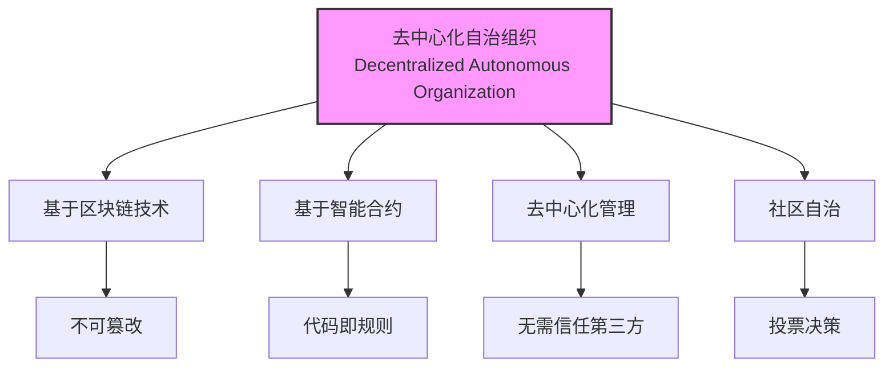

| 特征 | 传统组织 | 去中心化自治组织(DAO) |
|------|----------|----------------------|
| **组织基础** | 法律文件、章程 | 区块链上的智能合约代码 |
| **规则执行** | 人工执行、司法保障 | 代码自动执行、区块链共识 |
| **管理方式** | 中心化决策 | 社区投票决策 |
| **透明度** | 有限透明 | 完全透明 |
| **参与门槛** | 地域限制、身份要求 | 全球开放、无身份限制 |

DAO的核心理念是"代码即法律"(Code is Law)，通过区块链的共识协议来维护组织规章制度的正常执行。

## TheDAO项目介绍

2016年5月，一个名为"TheDAO"的项目在以太坊平台上启动，这是一个致力于众筹投资的去中心化自治组织。

### TheDAO运作机制

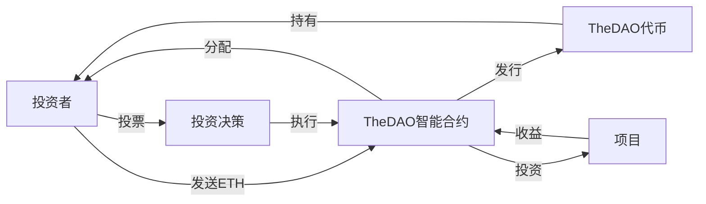

#### TheDAO与传统投资基金对比

| 特征 | 传统投资基金 | TheDAO |
|------|-------------|--------|
| **决策机制** | 基金经理决策 | 代币持有者投票 |
| **透明度** | 定期报告 | 完全透明 |
| **资金管理** | 中心化托管 | 智能合约锁定 |
| **投资范围** | 基金章程规定 | 社区投票决定 |
| **收益分配** | 按协议分配 | 智能合约自动分配 |
| **退出机制** | 赎回基金份额 | 拆分DAO(Split DAO) |

### TheDAO众筹历程

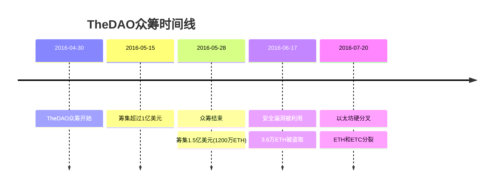

TheDAO众筹在短短一个月内筹集到了价值1.5亿美元的以太币，这在当时是前所未有的众筹规模和速度，远超传统众筹平台的记录。这一成功引起了整个互联网社区的广泛关注和讨论。

#### 知识点补充：DAO与DAC的区别

| 特征 | DAO(去中心化自治组织) | DAC(去中心化自治公司) |
|------|----------------------|----------------------|
| **英文全称** | Decentralized Autonomous Organization | Decentralized Autonomous Corporation |
| **主要目的** | 可以是非盈利性质 | 通常以盈利为目的 |
| **组织形式** | 更接近社区或基金会 | 更接近公司结构 |
| **法律地位** | 通常无法律实体 | 通常无法律实体 |
| **管理结构** | 扁平化 | 可能有类似董事会的结构 |

尽管DAC在名称上包含"Corporation"(公司)，但在现实社会中并不具备公司应有的法人地位，通常也没有传统公司的管理层次结构。

## TheDAO的拆分机制

TheDAO设计了一种名为"Split DAO"(拆分DAO)的机制，允许投资者在特定条件下退出。

### 拆分DAO流程

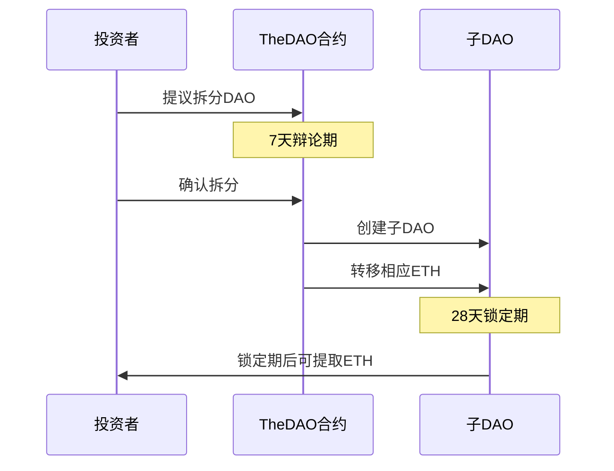

#### 拆分DAO机制设计目的

| 目的 | 说明 |
|------|------|
| **投资自由** | 允许投资理念不同的少数派创建自己的投资组合 |
| **退出机制** | 为不满意的投资者提供退出渠道 |
| **资金取回** | 投资者取回投资和收益的主要途径 |
| **民主保障** | 体现对少数派投资者权益的尊重 |
| **分歧解决** | 避免因投资决策分歧导致的内部冲突 |

拆分DAO的一个极端例子是单个投资者成立一个子基金，然后将所有资金投给自己，这实际上是投资者取回投资和收益的唯一途径。TheDAO没有实现类似"withdraw"的函数来直接提取资金。

## TheDAO安全漏洞

TheDAO的代码中存在一个严重的安全漏洞，这个漏洞与我们前面学习的重入攻击(Reentrancy Attack)有关。

### 漏洞代码分析

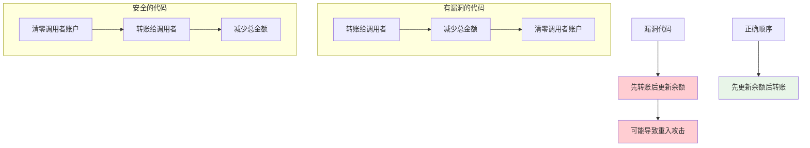

#### 漏洞代码示例

```solidity
// TheDAO中有漏洞的代码(简化版)
function splitDAO() {
    // 计算投资者应得的ETH
    uint amount = balances[msg.sender];
    
    // 先转账
    if (msg.sender.call.value(amount)()) {
        // 后更新状态
        totalSupply -= amount;
        balances[msg.sender] = 0;
    }
}
```

#### 安全的代码示例

```solidity
// 安全的代码应该是
function splitDAO() {
    // 计算投资者应得的ETH
    uint amount = balances[msg.sender];
    
    // 先更新状态
    balances[msg.sender] = 0;
    totalSupply -= amount;
    
    // 后转账
    if (!msg.sender.send(amount)) {
        // 如果转账失败，恢复状态
        balances[msg.sender] = amount;
        totalSupply += amount;
        return false;
    }
}
```

### 重入攻击原理

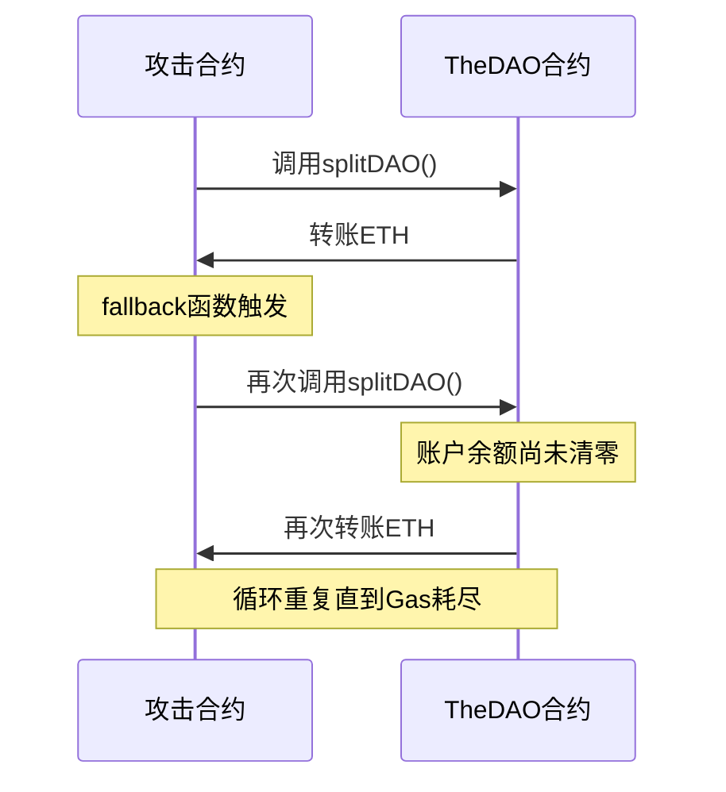

#### 知识点补充：重入攻击防御

重入攻击是智能合约中最常见的安全漏洞之一。防御措施包括：

1. **检查-效果-交互模式**：先更新所有状态变量，再进行外部调用
2. **重入锁**：使用互斥锁防止重复调用
3. **限制Gas**：使用transfer()或send()函数限制Gas(2300)
4. **避免外部调用**：尽量减少对不信任合约的调用

```solidity
// 使用重入锁
bool private locked = false;

modifier nonReentrant() {
    require(!locked, "重入锁定");
    locked = true;
    _;
    locked = false;
}

function splitDAO() nonReentrant {
    // 函数代码
}
```

## TheDAO攻击事件

### 攻击过程与影响

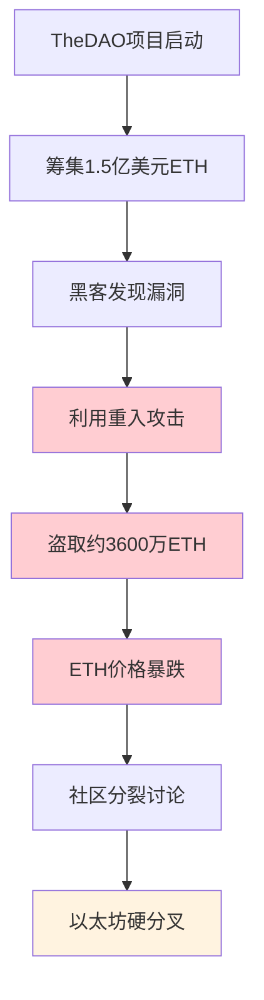

2016年6月17日，黑客利用TheDAO的重入漏洞，转走了价值约5000万美元的以太币(约占TheDAO资金的三分之一)。这一事件在以太坊社区引起了巨大恐慌，导致ETH价格大幅下跌。

#### TheDAO攻击事件数据

| 数据项 | 数值 | 说明 |
|--------|------|------|
| **TheDAO总资金** | 1200万ETH | 约1.5亿美元(当时价格) |
| **被盗资金** | 360万ETH | 约5000万美元(当时价格) |
| **被盗比例** | ~30% | TheDAO总资金的约三分之一 |
| **锁定期** | 28天 | 子DAO资金锁定期 |
| **ETH价格影响** | ~50%下跌 | 从约20美元跌至约10美元 |

### 黑客的辩解

攻击发生后，网上流传了一封据称是黑客写给以太坊社区的公开信。黑客在信中辩称自己没有做错任何事情，只是利用了代码中的一个"特性"(feature)。

#### 黑客观点与"代码即法律"理念

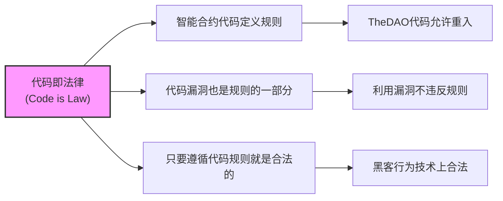

黑客的核心论点是：智能合约的规则完全由代码定义，而不是开发者的意图。如果代码允许某种行为，那么这种行为就是合法的。

## 社区分裂与解决方案

TheDAO事件后，以太坊社区对如何应对分裂为两派。

### 两派观点对比

| 观点 | 支持回滚交易 | 反对回滚交易 |
|------|------------|------------|
| **核心理念** | 保护投资者利益 | 维护区块链不可篡改性 |
| **主要论点** | TheDAO规模过大，影响整个生态 | 干预违背去中心化精神 |
| **技术立场** | 可以通过硬分叉修复 | 代码即法律，不应干预 |
| **影响评估** | 不干预将损害以太坊声誉 | 干预将破坏区块链信任基础 |
| **类比论据** | "Too Big To Fail"(大而不能倒) | 每个智能合约出问题都干预会混乱 |

#### 知识点补充："Too Big To Fail"概念

"Too Big To Fail"(大而不能倒)概念源自2008年金融危机，当时美国政府救助了房地产巨头房利美(Fannie Mae)和房地美(Freddie Mac)，理由是这些机构过于庞大，倒闭将对整个经济造成灾难性影响。

TheDAO持有当时以太坊总流通量约14%的ETH，规模之大使其成为"Too Big To Fail"的典型案例。如果不干预，大量ETH将落入黑客手中，可能对整个以太坊生态造成毁灭性打击。

### 解决方案探索

#### 为什么简单分叉不可行？

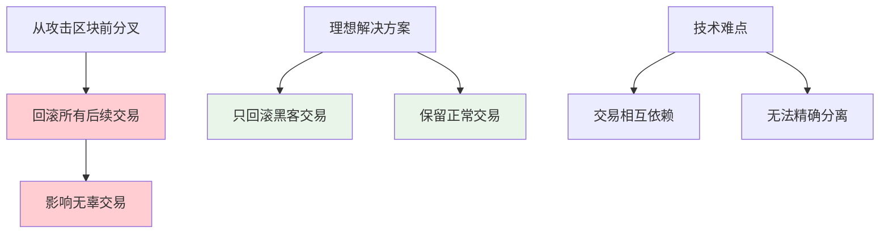

简单从攻击发生前的区块开始分叉是不可行的，因为这样会导致所有后续的正常交易也被回滚，包括与TheDAO无关的转账和其他智能合约操作。

#### 两步走解决方案

以太坊团队制定了两步走的方案：

1. **软分叉**：锁定黑客账户
2. **硬分叉**：将TheDAO资金转移到新合约

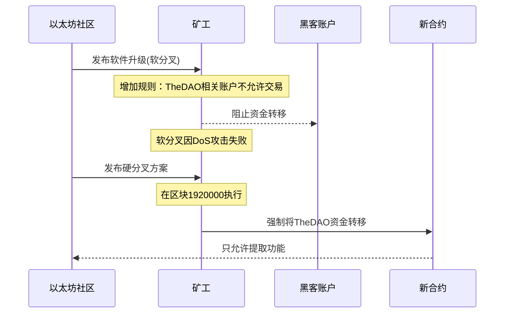

## 以太坊硬分叉

### 硬分叉执行过程

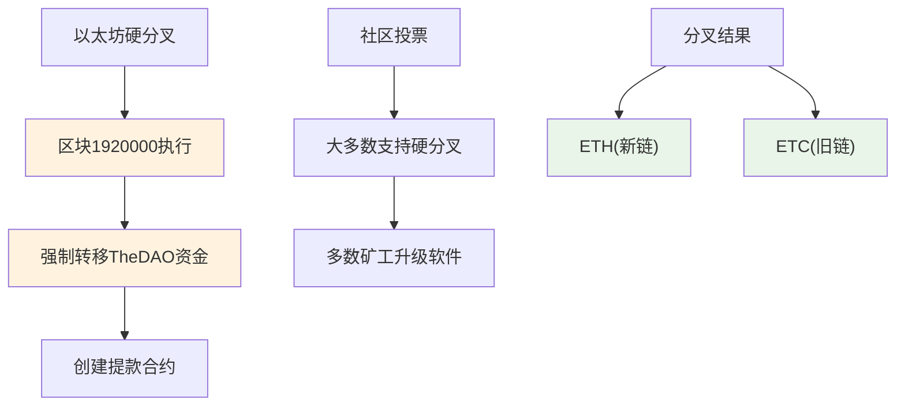

硬分叉在区块1920000执行，将TheDAO及其子DAO中的所有资金强制转移到一个新的智能合约中。这个新合约只有一个功能：允许原TheDAO代币持有者按比例提取以太币。

### 以太坊分裂为ETH和ETC

尽管社区投票和大多数矿工支持硬分叉，但仍有一部分人坚持"代码即法律"的理念，继续在原链上挖矿，形成了以太坊经典(Ethereum Classic, ETC)。

#### ETH与ETC对比

| 特征 | 以太坊(ETH) | 以太坊经典(ETC) |
|------|------------|----------------|
| **分叉立场** | 支持硬分叉 | 反对硬分叉 |
| **核心理念** | 社区共识可干预 | 代码即法律，不可篡改 |
| **开发团队** | 原以太坊核心团队 | 新成立的开发团队 |
| **市值对比** | 主流，市值更高 | 小众，市值较低 |
| **技术路线** | 向PoS转型 | 保持PoW |

#### 知识点补充：硬分叉的技术挑战

硬分叉后，两条链并存带来了一些技术挑战，特别是重放攻击(Replay Attack)问题：

- **重放攻击**：在一条链上的合法交易可以在另一条链上重放
- **原因**：两条链代码相似，使用相同的账户私钥
- **解决方案**：后续为两条链增加了链ID(Chain ID)，防止交易跨链重放

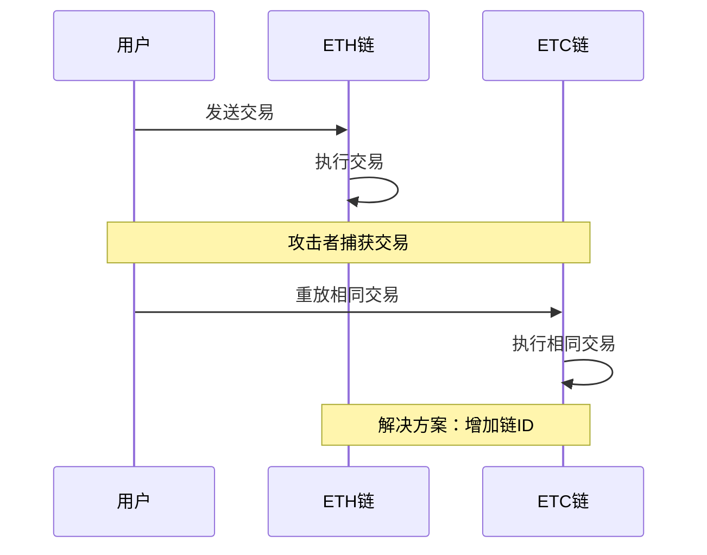

## TheDAO事件的影响与教训

### 对以太坊生态的影响

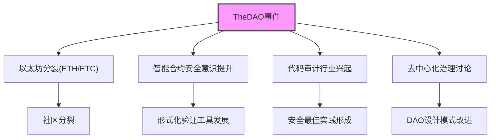

TheDAO事件是以太坊历史上的转折点，它不仅导致了区块链的分裂，也深刻改变了社区对智能合约安全的认识。

### 关键教训总结

| 教训 | 说明 | 影响 |
|------|------|------|
| **代码安全至关重要** | 智能合约一旦部署无法修改 | 部署前必须全面测试和审计 |
| **治理机制需要平衡** | 纯粹的"代码即法律"有局限性 | 需要设计应急响应机制 |
| **资金分散化原则** | 避免将过多资金集中在单一合约 | 降低系统性风险 |
| **升级机制的必要性** | 合约需要安全的升级路径 | 代理合约模式流行 |
| **社区共识的重要性** | 危机处理需要有效的决策机制 | 改进链上治理机制 |

#### 知识点补充：现代智能合约安全实践

TheDAO事件后，以太坊社区发展了多种安全实践：

1. **形式化验证**：使用数学方法证明合约行为符合预期
2. **标准化模块**：使用经过审计的标准库(如OpenZeppelin)
3. **可升级合约**：使用代理模式实现合约升级
4. **多重签名钱包**：需要多方确认的资金管理机制
5. **时间锁**：关键操作需要等待一段时间才能执行
6. **限额机制**：限制单次操作的资金量
7. **紧急停止**：在发现问题时可以暂停合约功能

## 总结

TheDAO事件是区块链历史上的重要一课，它揭示了智能合约安全的重要性，也引发了对区块链治理模式的深刻思考。

### TheDAO事件关键要点

| 要点 | 说明 | 重要性 |
|------|------|--------|
| **安全漏洞** | 重入攻击导致资金被盗 | 🔴 核心问题 |
| **社区分裂** | 干预vs不干预的理念冲突 | 🔴 关键影响 |
| **硬分叉** | 以太坊分裂为ETH和ETC | 🔴 历史转折 |
| **代码即法律** | 理念的挑战与平衡 | 🟡 思想演进 |
| **安全实践** | 推动了安全标准的发展 | 🟡 积极影响 |

TheDAO事件提醒我们，区块链技术虽然有着去中心化的理想，但在实际应用中仍需要平衡技术理想与现实需求，建立更加完善的治理机制和安全实践。
