**24-ETH-反思优化版 (Av37065233, P24)**

本章节详细介绍以太坊TheDAO事件后的反思与启示。

## 智能合约本质反思

### 智能合约的真实本质

#### 智能合约vs自动合约对比

| 特征 | 智能合约 | 传统自动合约 |
|------|----------|--------------|
| **本质** | 自动执行的代码合同 | 预设规则的自动执行机制 |
| **智能程度** | 无人工智能技术 | 无人工智能技术 |
| **修改难度** | 极难修改（需硬分叉） | 相对容易修改 |
| **执行环境** | 区块链网络 | 中心化服务器 |
| **现实例子** | 以太坊合约 | ATM取款机 |
| **透明度** | 完全透明 | 有限透明 |

```mermaid
graph TD
    A[智能合约本质] --> B[自动合约/代码合同]
    A --> C[非"智能"的合约]
    
    B --> D[预设规则自动执行]
    B --> E[无需人工干预]
    
    C --> F[不包含人工智能技术]
    C --> G[无自主学习能力]
    
    D --> H[ATM取款机]
    D --> I[自动售货机]
    D --> J[以太坊智能合约]
    
    style A fill:#f9f,stroke:#333,stroke-width:2px
    style B fill:#e8f5e8
    style C fill:#fff3e0
```

### 不可篡改性的双刃剑

#### 不可篡改性的利弊分析

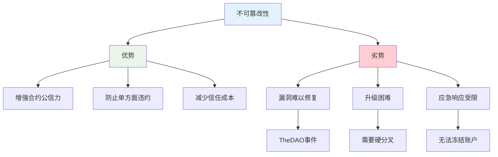

| 方面 | 优势 | 劣势 |
|------|------|------|
| **安全性** | 防止单方面修改 | 漏洞无法及时修复 |
| **升级机制** | 增强规则稳定性 | 需要硬分叉才能升级 |
| **应急响应** | 防止不当干预 | 无法冻结可疑账户 |
| **漏洞处理** | 促进前期审计重视 | 发现漏洞后难以补救 |
| **用户体验** | 规则确定性高 | 灵活性低 |

> **知识点补充：安全漏洞的紧急处理**
> 
> 在区块链环境中处理安全漏洞与传统软件有本质区别：
> 
> 1. **传统软件**：发现漏洞后可立即发布补丁，用户更新后即可修复
> 2. **区块链系统**：
>    - 需要进行网络共识（硬分叉）
>    - 公开漏洞信息会增加被攻击风险
>    - 在共识达成前无法阻止攻击
>    - 修复过程需要绝大多数节点配合

#### 漏洞应对策略

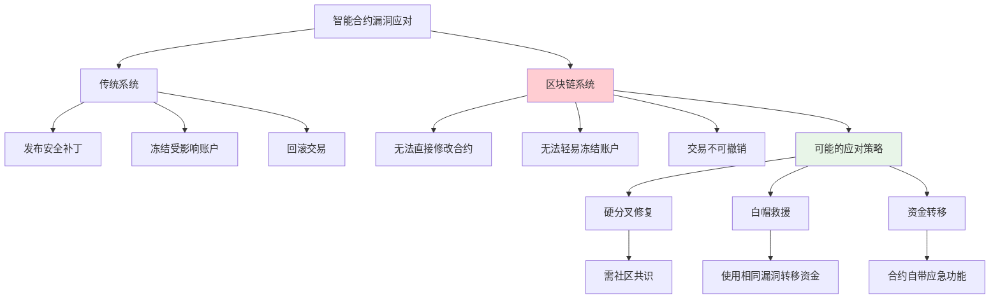

TheDAO事件后的一个重要启示是：当智能合约存在漏洞且资金面临风险时，可以考虑使用"白帽救援"策略——利用相同的漏洞将资金转移到安全合约中，以防止黑客进一步攻击。

## 区块链可变性反思

### 不可篡改的相对性

#### 区块链可变性分析

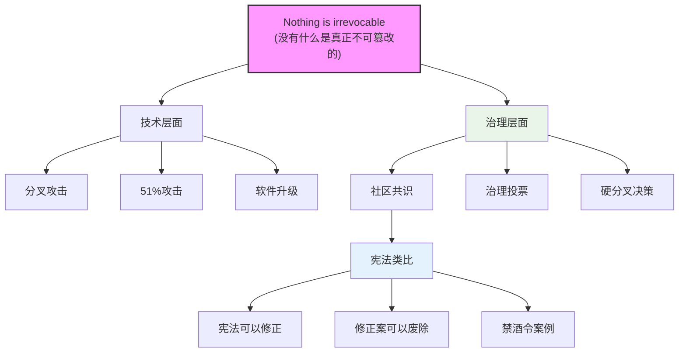

| 篡改机制 | 技术原理 | 实例 | 难度 |
|----------|----------|------|------|
| **分叉攻击** | 从某区块开始创建更长链 | 双花攻击 | 需要大量算力 |
| **软件升级** | 通过硬分叉改变规则 | TheDAO救援 | 需要社区共识 |
| **51%攻击** | 控制网络大部分算力 | 小型币种被攻击 | 大型网络几乎不可能 |
| **社区治理** | 通过投票决定重大变更 | 以太坊硬分叉 | 依赖社区参与 |

> **知识点补充：美国宪法修正案与禁酒令**
> 
> 美国宪法第18修正案（禁酒令）是历史上唯一一个被完全废除的修正案：
> 
> - **1919年**：第18修正案通过，禁止酒精饮料的生产、销售和运输
> - **实施效果**：
>   - 地下黑市兴起
>   - 有组织犯罪增加
>   - 执法困难
> - **1933年**：第21修正案通过，完全废除第18修正案
> 
> 这一历史事件说明，即使是最高级别的规则（如宪法），在必要时也可以被修改或废除。区块链治理可以从中汲取经验。

### 区块链治理机制

#### 去中心化治理模型

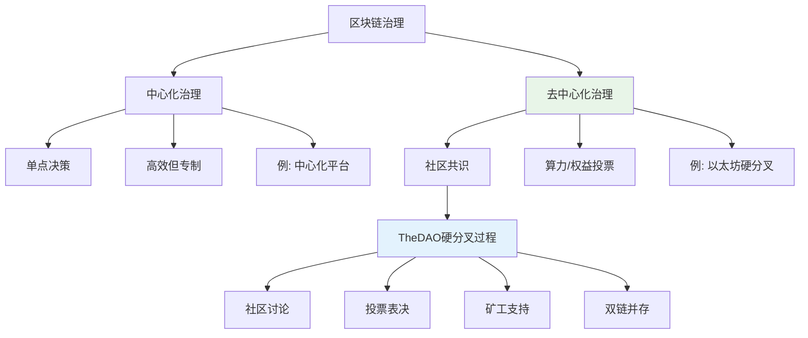

TheDAO事件后的硬分叉决策过程展示了去中心化治理的实际运作：

1. 以太坊团队提出硬分叉方案
2. 社区进行广泛讨论和投票
3. 90%以上矿工选择支持硬分叉
4. 少数不同意的矿工继续维护原链（以太坊经典）
5. 最终形成ETH和ETC两条平行链

这一过程表明，去中心化不是指完全没有人为干预，而是指对规则的修改需要通过去中心化的方式达成共识。

> **知识点补充：分叉作为民主机制**
> 
> 区块链的分叉能力实际上是一种民主机制：
> 
> - **退出权**：不满意现有规则时可以选择分叉
> - **市场选择**：多条链并存，由市场决定价值
> - **防止专制**：核心开发团队无法强制所有人接受变更
> - **维塔利克的故事**：因暴雪公司单方面修改《魔兽世界》游戏规则而萌生创建以太坊的想法

## 编程语言设计反思

### 重入攻击与语言特性

#### 重入攻击原理分析

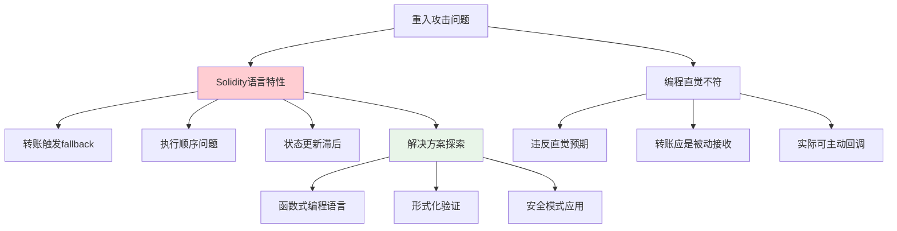

| 语言特性 | 安全隐患 | 解决方案 |
|----------|----------|----------|
| **转账触发fallback** | 可能导致重入攻击 | 先更新状态再转账 |
| **状态更新顺序** | 转账前状态未更新 | 使用重入锁 |
| **执行环境连续性** | 允许递归调用 | 检查-效果-交互模式 |
| **异常处理机制** | 异常可能被忽略 | 使用require/assert |
| **隐式行为** | 开发者易忽视 | 明确文档和训练 |

> **知识点补充：函数式编程语言**
> 
> 函数式编程语言（如OCaml）具有以下特点：
> 
> - **不可变状态**：状态不可直接修改，降低副作用
> - **模式匹配**：代码更加直观和安全
> - **形式化验证**：更容易进行数学证明
> - **性能权衡**：通常执行效率低于命令式语言
> - **学习曲线**：对大多数开发者不够直观

### 语言表达能力权衡

#### 编程语言表达能力对比

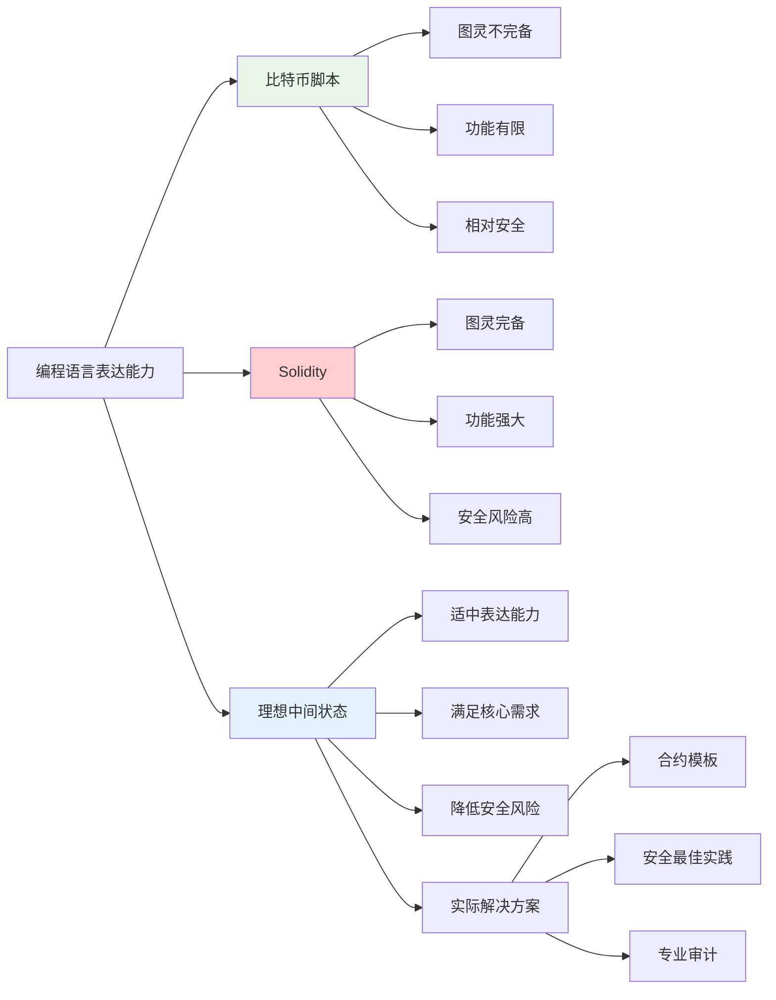

TheDAO事件后，业界对智能合约语言表达能力的讨论主要集中在以下几点：

1. **比特币脚本**：图灵不完备，功能有限但相对安全
2. **Solidity**：图灵完备，功能强大但安全风险高
3. **理想状态**：寻找表达能力适中的语言设计

> **知识点补充：比特币脚本白名单**
> 
> 尽管比特币脚本理论上可以实现多种功能，但实际上大多数矿工只接受少数几种标准脚本模式：
> 
> - P2PKH (Pay to Public Key Hash)
> - P2SH (Pay to Script Hash)
> - P2WPKH (Pay to Witness Public Key Hash)
> - P2WSH (Pay to Witness Script Hash)
> 
> 这种"白名单"机制实际上是比特币网络对脚本表达能力的一种实际限制，提高了安全性但降低了灵活性。

#### 智能合约发展趋势

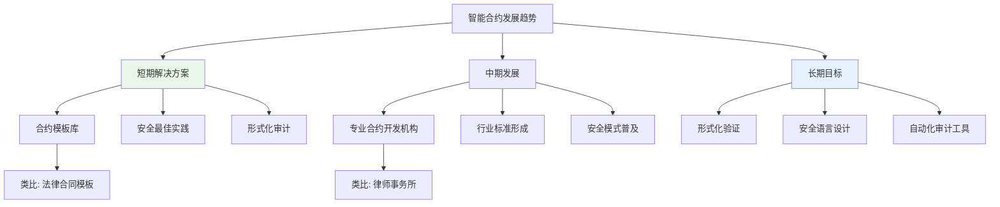

智能合约的发展可能会借鉴传统法律合同的模式：

1. **标准化模板**：常用功能的标准实现
2. **专业开发机构**：类似律师事务所的智能合约开发公司
3. **行业最佳实践**：成熟的安全模式和设计模式

## 开源与安全性反思

### 开源的安全假设

#### "多眼效应"的误区

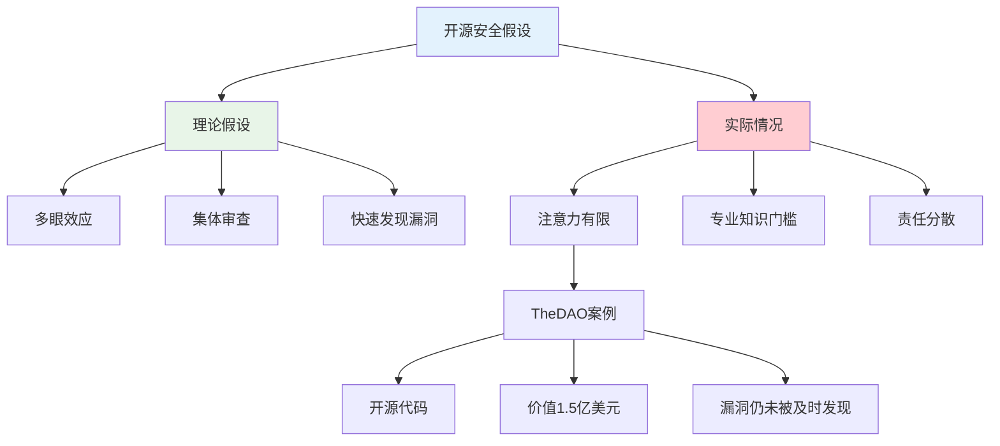

| 开源安全假设 | 理论预期 | 实际情况 |
|--------------|----------|----------|
| **多眼效应** | 更多人审查，更安全 | 大多数人不会审查代码 |
| **透明度** | 公开代码增强信任 | 透明不等于安全 |
| **快速修复** | 漏洞被迅速发现和修复 | 重大漏洞可能长期存在 |
| **社区审计** | 社区集体智慧保障安全 | 专业审计仍然必不可少 |
| **用户参与** | 用户会验证后再使用 | 大多数用户直接信任 |

> **知识点补充：Linus法则与"多眼效应"误区**
> 
> Linus法则："足够多的眼睛，所有的bug都是浅显的"(Given enough eyeballs, all bugs are shallow)
> 
> 这一法则在区块链领域面临的挑战：
> 
> 1. **注意力稀缺**：即使代码开源，真正审查的人很少
> 2. **专业知识要求**：智能合约安全审计需要专业知识
> 3. **责任分散**：每个人都认为别人会检查
> 4. **历史案例**：多个知名开源项目的严重漏洞存在多年未被发现

### 安全最佳实践

#### 智能合约安全保障机制

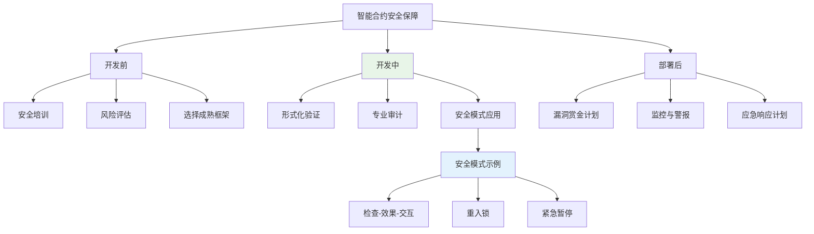

TheDAO事件后，智能合约安全最佳实践逐渐形成，包括：

1. **专业安全审计**：不能仅依赖社区审查
2. **形式化验证**：数学方法证明合约行为符合预期
3. **安全设计模式**：如检查-效果-交互模式、重入锁等
4. **漏洞赏金计划**：激励白帽黑客发现漏洞
5. **应急响应机制**：预先设计应对漏洞的方案

## 去中心化与分布式系统反思

### 去中心化与分布式的区别

#### 概念对比与分析

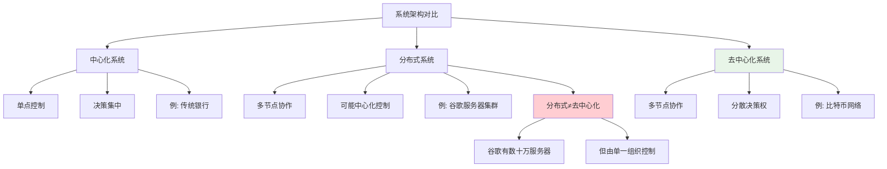

| 系统类型 | 节点分布 | 控制权 | 决策机制 | 典型例子 |
|----------|----------|--------|----------|----------|
| **中心化** | 单点或集中 | 单一实体 | 自上而下 | 传统银行系统 |
| **分布式非去中心化** | 地理分散 | 单一实体 | 协调一致 | 谷歌服务器集群 |
| **去中心化** | 地理分散 | 多方分散 | 共识机制 | 比特币网络 |

> **知识点补充：状态机复制模型**
> 
> 区块链使用的状态机复制模型与传统分布式系统有显著区别：
> 
> 1. **传统分布式系统**：
>    - 目标：提高处理速度和吞吐量
>    - 方法：任务分解，不同节点处理不同任务
>    - 理想：线性加速比（10台机器比1台快10倍）
>    - 实际：有通信开销，通常达到6-7倍加速
> 
> 2. **区块链状态机复制**：
>    - 目标：提高容错性和去信任
>    - 方法：所有节点重复执行相同操作
>    - 特点：性能低于单机系统
>    - 应用：关键任务系统（航空交通管制、航天飞机等）

### 区块链适用场景

#### 区块链应用场景分析

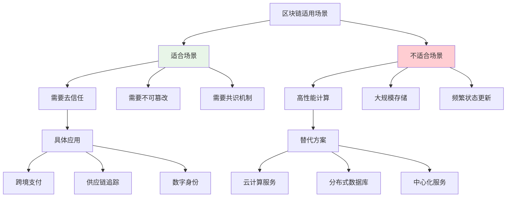

理解区块链的技术特性有助于确定其适用场景：

1. **适合场景**：
   - 互不信任实体间的价值传递
   - 需要防篡改的数据存储
   - 需要透明公开的决策过程

2. **不适合场景**：
   - 高性能计算需求
   - 大规模数据存储
   - 需要频繁状态更新的应用

> **知识点补充：区块链与传统系统的选择**
> 
> 选择区块链还是传统系统时的考量因素：
> 
> 1. **性能需求**：区块链通常吞吐量低、延迟高
> 2. **信任环境**：完全可信环境不需要区块链
> 3. **成本效益**：区块链系统维护成本高
> 4. **监管合规**：某些领域的监管要求可能与区块链特性冲突
> 5. **用户体验**：区块链应用通常用户友好度较低

## 总结与展望

### 关键反思要点

#### 以太坊发展的反思总结

```mermaid
graph TD
    A[以太坊反思要点] --> B[技术层面]
    A --> C[治理层面]
    A --> D[应用层面]
    
    B --> B1[智能合约非"智能"]
    B --> B2[不可篡改是双刃剑]
    B --> B3[语言设计权衡]
    
    C --> C1[去中心化治理机制]
    C --> C2[分叉作为民主表达]
    C --> C3[社区共识重要性]
    
    D --> D1[开源≠自动安全]
    D --> D2[专业审计必要性]
    D --> D3[场景适用性思考]
    
    style A fill:#f9f,stroke:#333,stroke-width:2px
    style B fill:#e8f5e8
    style C fill:#e3f2fd
    style D fill:#fff3e0
```

| 反思维度 | 关键要点 | 实践启示 |
|----------|----------|----------|
| **智能合约本质** | "智能"合约并不智能 | 理性看待技术能力 |
| **不可篡改性** | 双刃剑效应 | 设计应急机制 |
| **区块链可变性** | 没有绝对不可变 | 治理机制重要性 |
| **语言设计** | 表达能力与安全性平衡 | 发展标准模板 |
| **开源安全** | 多眼效应误区 | 专业审计必不可少 |
| **去中心化本质** | 与分布式系统区别 | 明确适用场景 |

### 未来发展方向

TheDAO事件对以太坊乃至整个区块链行业都是一次宝贵的学习经验。通过这些反思，区块链技术将在以下方向继续发展：

1. **安全最佳实践**：形成更成熟的安全开发流程和模式
2. **专业化分工**：出现专门的智能合约开发和审计机构
3. **治理机制完善**：更加成熟的去中心化治理模式
4. **技术创新**：更安全的编程语言和开发工具
5. **应用场景聚焦**：更加专注于区块链真正适合的应用领域

区块链技术仍处于早期发展阶段，通过不断总结经验教训，这一技术将逐步走向成熟，发挥其独特价值。
