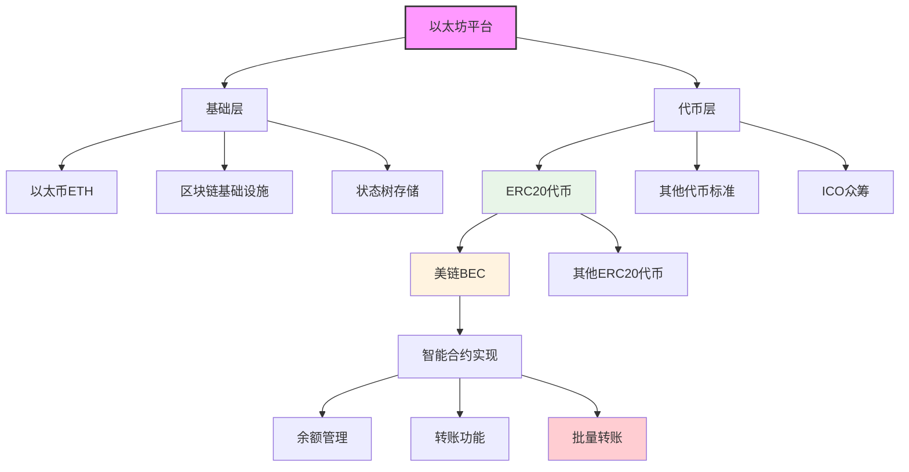
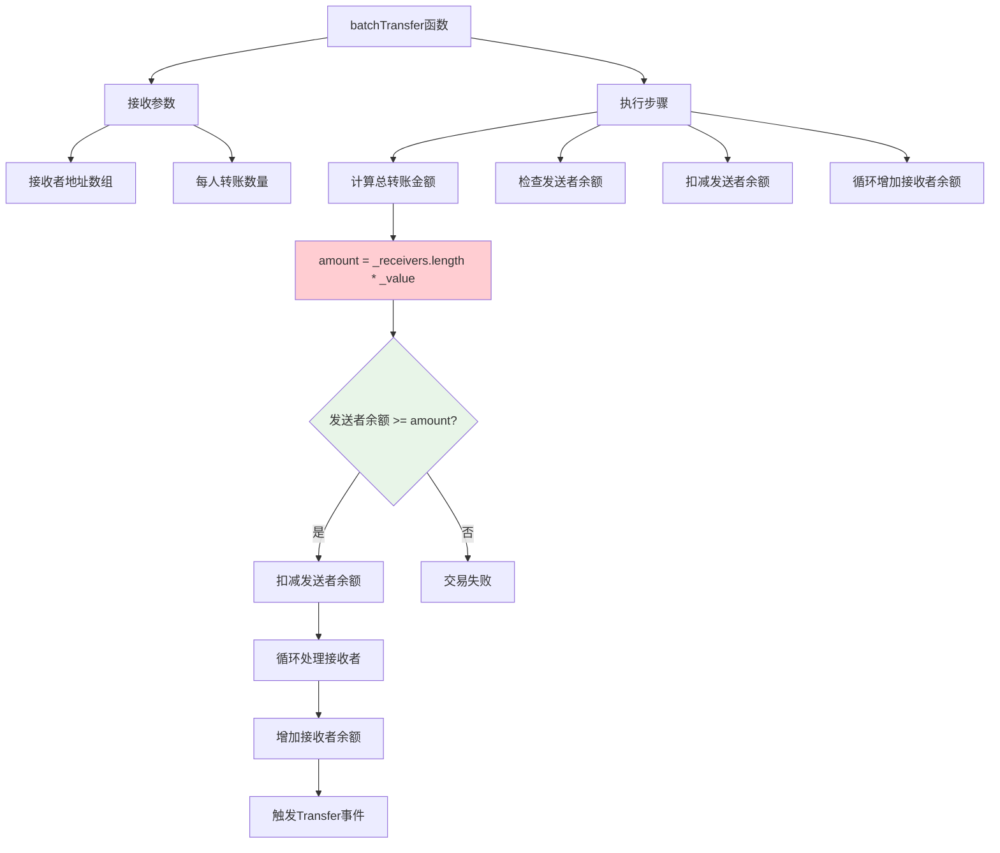
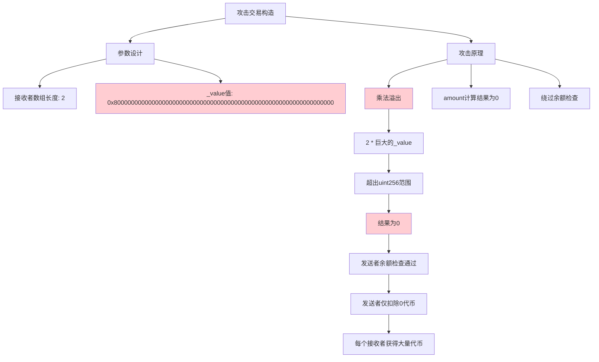
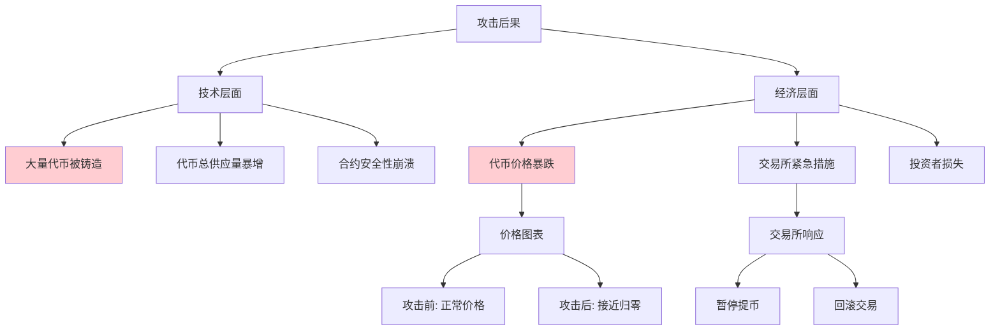
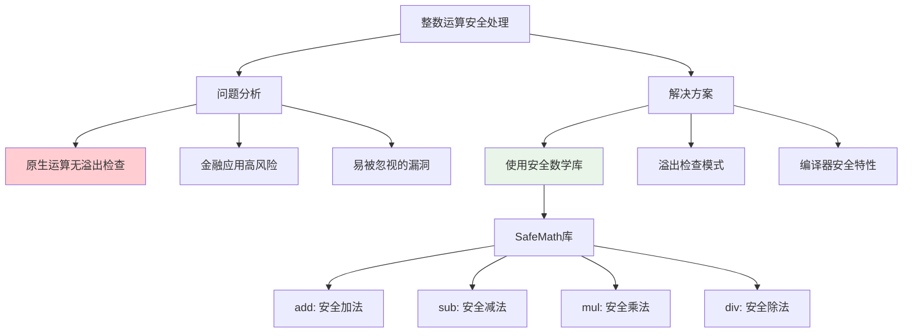
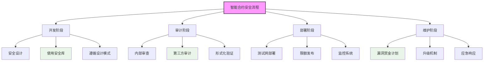

**25. ETH 美链安全事件**

本章节详细介绍以太坊平台上发生的美链(Beauty Chain)智能合约安全事件及其技术原理分析。

## 事件概述

美链(Beauty Chain)是以太坊平台上发行的一种代币，其智能合约在2018年4月发生严重安全漏洞，导致大量代币被恶意铸造，最终造成代币价值崩盘。

### 代币与智能合约的关系

#### 以太坊代币发行机制

| 概念 | 说明 | 技术实现 | 重要性 |
|------|------|----------|--------|
| **代币(Token)** | 以太坊平台上发行的数字资产 | 智能合约 | 🔴 核心概念 |
| **智能合约** | 代币的底层实现 | Solidity代码 | 🔴 核心技术 |
| **ERC20标准** | 代币合约接口规范 | 标准化接口 | 🟡 行业标准 |
| **账户余额** | 代币持有数量 | 合约存储变量 | 🟡 基础功能 |
| **转账机制** | 代币所有权转移 | 合约函数调用 | 🟡 基础功能 |
| **发行规则** | 代币创建与分配规则 | 合约逻辑 | 🟡 基础功能 |



### 代币与原生币的区别

#### ETH与ERC20代币对比

| 特征 | 以太币(ETH) | ERC20代币 | 区别说明 |
|------|------------|-----------|----------|
| **底层机制** | 区块链原生货币 | 智能合约实现 | 实现层次不同 |
| **账户管理** | 状态树直接记录 | 合约内部映射 | 存储位置不同 |
| **转账方式** | 区块链交易 | 合约函数调用 | 操作方式不同 |
| **共识保障** | 全网共识机制 | 合约代码逻辑 | 安全保障不同 |
| **创建机制** | 挖矿奖励产生 | 合约定义规则 | 发行方式不同 |
| **存在形式** | 账户状态字段 | 合约存储变量 | 数据结构不同 |

> **知识点补充：ERC20标准**
> 
> ERC20(Ethereum Request for Comments 20)是以太坊上最常用的代币标准，定义了代币合约必须实现的接口和行为：
> 
> 1. **必须实现的功能**：
>    - `totalSupply()`: 返回代币总供应量
>    - `balanceOf(address)`: 返回指定地址的代币余额
>    - `transfer(address, amount)`: 向指定地址转账
>    - `transferFrom(from, to, amount)`: 从指定地址转账到另一地址
>    - `approve(spender, amount)`: 授权第三方使用代币
>    - `allowance(owner, spender)`: 查询授权额度
> 
> 2. **标准事件**：
>    - `Transfer(from, to, amount)`: 转账事件
>    - `Approval(owner, spender, amount)`: 授权事件
> 
> 3. **可选扩展**：
>    - 代币名称、符号、小数位数等元数据

## 美链代币合约分析

### 批量转账功能

美链合约中实现了一个`batchTransfer`批量转账函数，允许一次性向多个接收者发送相同数量的代币。

#### 批量转账函数实现



### 漏洞代码分析

#### 关键漏洞代码

```solidity
function batchTransfer(address[] _receivers, uint256 _value) public whenNotPaused returns (bool) {
    uint cnt = _receivers.length;
    uint256 amount = uint256(cnt) * _value;
    require(cnt > 0 && cnt <= 20);
    require(_value > 0 && balances[msg.sender] >= amount);

    balances[msg.sender] = balances[msg.sender].sub(amount);
    for (uint i = 0; i < cnt; i++) {
        balances[_receivers[i]] = balances[_receivers[i]].add(_value);
        Transfer(msg.sender, _receivers[i], _value);
    }
    return true;
}
```

#### 整数溢出漏洞分析表

| 漏洞点 | 代码行 | 漏洞类型 | 安全影响 | 利用难度 |
|--------|--------|----------|----------|----------|
| **乘法溢出** | `uint256 amount = uint256(cnt) * _value;` | 整数溢出 | 🔴 严重 | 🟢 简单 |
| **余额检查** | `require(_value > 0 && balances[msg.sender] >= amount);` | 逻辑漏洞 | 🔴 严重 | 🟢 简单 |
| **代币增发** | 循环中的`balances[_receivers[i]].add(_value);` | 非授权增发 | 🔴 严重 | 🟢 简单 |

> **知识点补充：整数溢出**
> 
> 在计算机编程中，整数溢出是指当计算结果超出数据类型能表示的范围时发生的情况：
> 
> 1. **溢出原理**：
>    - 在Solidity中，`uint256`能表示的最大值是2^256-1
>    - 当计算结果超过这个值时，会从0开始"环绕"计数
> 
> 2. **溢出示例**：
>    - 如果`_value`设为2^255，`cnt`设为2
>    - 计算结果应为2^256，超出`uint256`范围
>    - 实际结果为0（环绕后的值）
> 
> 3. **安全隐患**：
>    - 在金融应用中可能导致资金损失
>    - 在代币合约中可能导致非授权增发
>    - 绕过余额检查和限制条件

## 攻击过程分析

### 攻击参数构造

#### 攻击交易详情



| 参数 | 值 | 说明 |
|------|------|------|
| **_receivers数组长度** | 2 | 两个接收地址 |
| **_value** | 0x8000...0000 (大数) | 精心设计的溢出值 |
| **计算结果amount** | 0 | 2 * _value溢出后为0 |
| **发送者扣除金额** | 0 | 未实际扣除代币 |
| **每个接收者获得金额** | 0x8000...0000 | 巨量代币 |

### 攻击结果与影响

#### 攻击后果分析



| 时间点 | 事件 | 影响 |
|--------|------|------|
| **2018年4月22日** | 攻击发生 | 漏洞被利用 |
| **攻击当天** | 代币价格暴跌 | 价值接近归零 |
| **攻击后两天** | 交易所暂停提币 | 防止攻击者套现 |
| **攻击后两天** | 交易所决定回滚交易 | 尝试挽回损失 |

> **知识点补充：代币安全事件影响范围**
> 
> 与TheDAO事件相比，美链安全事件的影响范围较小：
> 
> 1. **影响范围**：
>    - TheDAO: 影响整个以太坊生态，导致硬分叉
>    - 美链: 主要影响该代币持有者和相关交易所
> 
> 2. **资金规模**：
>    - TheDAO: 约1.5亿美元资金受影响
>    - 美链: 相对较小的市值
> 
> 3. **解决方案**：
>    - TheDAO: 需要以太坊网络硬分叉
>    - 美链: 交易所层面的交易回滚

## 技术反思与解决方案

### 安全编程实践

#### 整数运算安全处理



#### SafeMath库实现原理

```solidity
library SafeMath {
  function mul(uint256 a, uint256 b) internal pure returns (uint256) {
    if (a == 0) {
      return 0;
    }
    uint256 c = a * b;
    assert(c / a == b);
    return c;
  }
  
  // 其他安全运算函数...
}
```

| 函数 | 安全检查 | 防范风险 | 使用场景 |
|------|----------|----------|----------|
| **mul** | 乘法结果验证 | 乘法溢出 | 批量转账、费用计算 |
| **add** | 加法结果验证 | 加法溢出 | 余额增加、计数器 |
| **sub** | 减法下溢检查 | 减法下溢 | 余额扣减、倒计时 |
| **div** | 除零检查 | 除零错误 | 比例计算、分配 |

> **知识点补充：Solidity整数精度**
> 
> Solidity中的整数运算与许多编程语言不同：
> 
> 1. **精确计算**：
>    - Solidity中的整数运算是精确的，不存在浮点误差
>    - 两个整数相乘再相除，如果没有溢出，结果是精确的
> 
> 2. **无自动溢出检测**：
>    - Solidity 0.8.0之前版本不会自动检测溢出
>    - 0.8.0及之后版本默认会检测并在溢出时revert
> 
> 3. **类型转换**：
>    - 显式类型转换不会检查是否溢出
>    - 隐式转换在某些情况下会导致精度丢失

### 美链合约的错误

#### 代码分析与改进

```mermaid
graph TD
    A[美链合约错误] --> B[代码问题]
    A --> C[改进方案]
    
    B --> B1[仅部分使用SafeMath]
    B --> B2[关键乘法未使用安全库]
    B --> B3[代码审计不足]
    
    C --> C1[全面使用SafeMath]
    C --> C2[专业安全审计]
    C --> C3[形式化验证]
    
    B1 --> D[原代码分析]
    D --> D1[减法使用.sub()]
    D --> D2[加法使用.add()]
    D --> D3[乘法直接使用*]
    
    C1 --> E[修复代码]
    E --> E1[使用amount = uint256(cnt).mul(_value)]
    
    style B2 fill:#ffcdd2
    style D3 fill:#ffcdd2
    style E1 fill:#e8f5e8
```

| 代码部分 | 原始实现 | 安全实现 | 安全性差异 |
|----------|----------|----------|------------|
| **余额扣减** | `balances[msg.sender].sub(amount)` | 已使用SafeMath | ✅ 安全 |
| **余额增加** | `balances[_receivers[i]].add(_value)` | 已使用SafeMath | ✅ 安全 |
| **总额计算** | `uint256(cnt) * _value` | 应使用`uint256(cnt).mul(_value)` | ❌ 不安全 |

> **知识点补充：代码审计的重要性**
> 
> 美链事件揭示了智能合约审计的关键重要性：
> 
> 1. **不一致的安全实践**：
>    - 合约中部分操作使用了SafeMath
>    - 关键乘法操作却未使用安全库
>    - 不一致的安全实践可能是疏忽或对安全重要性认识不足
> 
> 2. **审计重点**：
>    - 数学运算，特别是涉及资产的计算
>    - 访问控制和权限管理
>    - 外部调用和重入风险
>    - 异常处理和边界条件
> 
> 3. **多层次验证**：
>    - 内部代码审查
>    - 第三方专业审计
>    - 形式化验证
>    - 公开赏金计划

## 行业影响与教训

### 智能合约安全最佳实践

#### 安全开发流程



### 常见智能合约漏洞类型

| 漏洞类型 | 描述 | 防范措施 | 严重程度 |
|----------|------|----------|----------|
| **整数溢出** | 数学运算超出数据类型范围 | 使用SafeMath库 | 🔴 严重 |
| **重入攻击** | 合约被调用时重新进入自身 | 检查-效果-交互模式 | 🔴 严重 |
| **访问控制** | 权限管理不当 | 明确的权限检查 | 🔴 严重 |
| **随机数问题** | 可预测的随机数生成 | 安全随机源 | 🟡 中等 |
| **拒绝服务** | 阻止合约正常运行 | 限制循环和Gas消耗 | 🟡 中等 |
| **前置交易** | 抢先执行交易获利 | 提交-揭示模式 | 🟡 中等 |

> **知识点补充：Solidity 0.8.0安全特性**
> 
> Solidity语言在0.8.0版本引入了重要的安全改进：
> 
> 1. **默认溢出检查**：
>    - 算术运算默认包含溢出检查
>    - 溢出时自动revert交易
>    - 不再需要显式使用SafeMath库
> 
> 2. **禁用包装**：
>    - 使用`unchecked { ... }`块可以禁用检查
>    - 在确保安全的情况下可提高Gas效率
> 
> 3. **自定义错误**：
>    - 使用`error`关键字定义自定义错误
>    - 比`require`/`assert`更节省Gas
>    - 提供更好的错误信息
> 
> 4. **ABI编码改进**：
>    - 更安全的ABI编码和解码
>    - 减少编码错误风险

## 总结

### 关键要点

#### 美链事件教训总结

| 方面 | 教训 | 行业影响 | 改进方向 |
|------|------|----------|----------|
| **代码安全** | 全面使用安全库 | 提高安全意识 | 安全编码标准 |
| **审计重要性** | 专业审计必不可少 | 审计需求增加 | 审计标准化 |
| **数学处理** | 谨慎处理整数运算 | 更多关注溢出问题 | 语言级安全特性 |
| **测试覆盖** | 边界条件全面测试 | 测试方法改进 | 自动化测试工具 |
| **开发流程** | 安全贯穿全流程 | 流程标准化 | DevSecOps实践 |

美链安全事件虽然影响范围不如TheDAO事件广泛，但作为一个典型的整数溢出漏洞案例，为智能合约开发者提供了宝贵的教训。这一事件强调了在处理资产相关运算时的谨慎性，以及全面使用安全库的重要性。

随着Solidity语言的发展和安全实践的完善，类似的漏洞将变得更加罕见，但智能合约开发者仍需保持警惕，将安全作为开发过程中的首要考虑因素。
