**26——区块链技术与应用总结 (Av37065233, P26)**

## 课程回顾与区块链现状

区块链技术作为一项前沿技术，目前仍处于早期发展阶段。完成本课程的学习，您已经具备了比社会上绝大多数人更深入的区块链技术知识。本章将从应用角度对区块链技术进行总结和展望。

### 区块链概念的滥用与误解

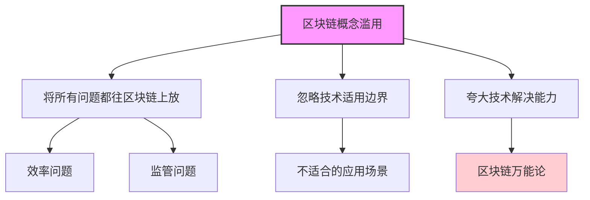

区块链技术面临的一个主要问题是概念被滥用。许多人将区块链视为解决一切问题的法宝，无论是效率问题还是监管问题，似乎只要应用区块链技术就能迎刃而解。这种观点是不正确的。

#### 误用案例分析：保险理赔

| 问题 | 传统理赔流程 | 区块链解决方案？ | 实际分析 |
|------|-------------|----------------|---------|
| **理赔速度慢** | 需要几周时间 | 区块链1小时内确认 | 瓶颈在于人工审核而非支付技术 |
| **支付效率** | 银行转账 | 区块链转账 | 支付技术本身不是瓶颈 |
| **核心问题** | 人工审核时间长 | 无法解决 | 区块链不能加速审核决策 |
| **适用性** | - | 低 | 区块链无法替代人工判断 |

保险理赔速度慢的问题不在于支付技术的局限性，而在于理赔内容需要人工审核。无论是汽车保险的事故理赔还是健康保险的医疗理赔，都需要专业人员进行审核评估。区块链技术在这方面并无优势。

#### 误用案例分析：防伪溯源

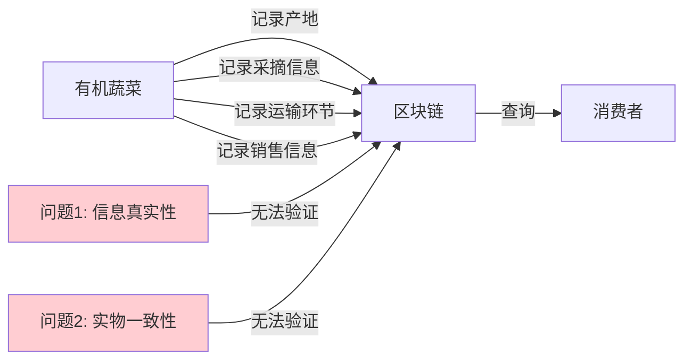

将有机蔬菜生产全过程记录到区块链上的应用场景存在明显缺陷：
- 区块链只能保证记录不被篡改，但无法保证记录的真实性
- 如果土地施过化肥或蔬菜喷洒过农药，但记录为有机，区块链无法检测
- 如果在运输销售过程中发生调包，区块链同样无法检测

区块链的不可篡改性只能保证已写入的内容不被更改，但无法验证写入内容的真实性。

### 信任机制与去中心化的争议

#### 去中心化与信任的关系

| 观点 | 内容 | 分析 |
|------|------|------|
| **质疑观点** | 互不信任实体间无法交易 | 部分合理 |
| **举例** | 去中心化电商如何保证交易安全 | 确实存在挑战 |
| **现实问题** | 支付后不发货或质量问题如何解决 | 传统解决方案依赖中心化机构 |
| **解决思路** | 中心化与去中心化不是非此即彼 | 可以结合两者优势 |

去中心化和中心化的界限并非黑白分明。在成功的商业模式中，可以同时存在中心化和去中心化的成分。

#### 知识点补充：中心化与去中心化的混合模式

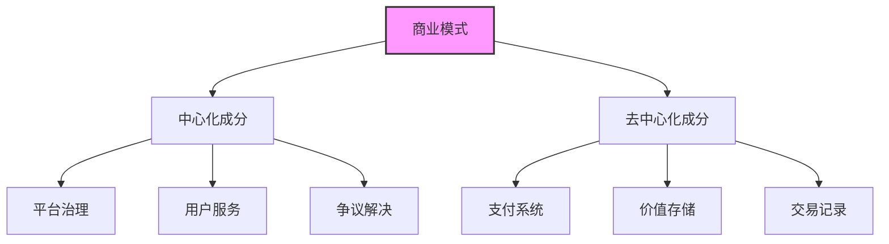

比特币作为一种支付方式，可以被中心化的商业模式所采用。例如，亚马逊这样的中心化电商平台可以接受比特币作为支付方式，这是完全正常的商业决策。不应该因为区块链是去中心化的，就认为所有采用区块链支付的商业模式也必须是去中心化的。

## 区块链不可篡改性的讨论

### 交易不可撤销的争议

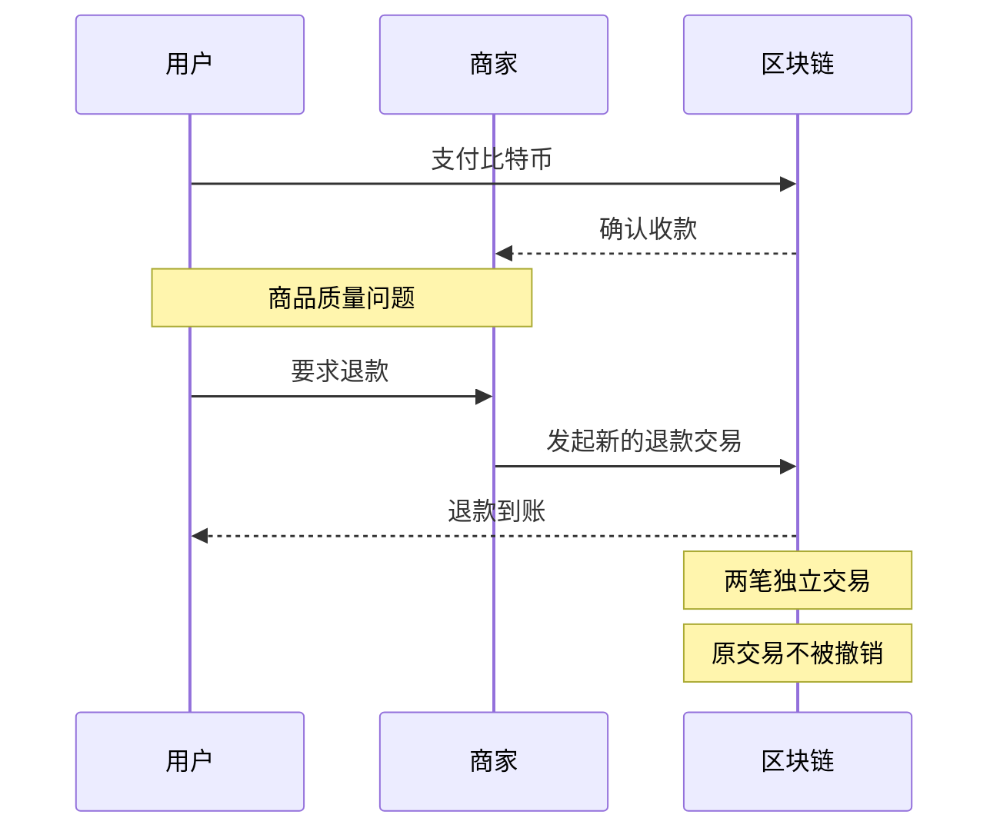

区块链交易一旦确认就无法撤销，这引发了一些争议。例如，在网购场景中，如果用户支付后商家不发货或商品有质量问题，传统支付方式可以申请退款，而区块链支付似乎无法撤销。

#### 交易撤销与退款的对比

| 特征 | 传统支付系统 | 区块链支付系统 |
|------|------------|--------------|
| **退款机制** | 申诉后撤销原交易 | 发起新的退款交易 |
| **交易记录** | 显示为撤销或退款 | 两笔独立交易 |
| **实际效果** | 资金返还给用户 | 资金返还给用户 |
| **本质区别** | 表面上的撤销 | 明确的新交易 |

实际上，传统支付系统中的"撤销"也不是真正取消原交易，而是发起一笔新的退款交易。例如，信用卡退款会在记录中显示两笔交易：一笔是原付款，一笔是退款。区块链支付同样可以通过发起新的退款交易来实现相同效果。

### 法律监管与保护问题

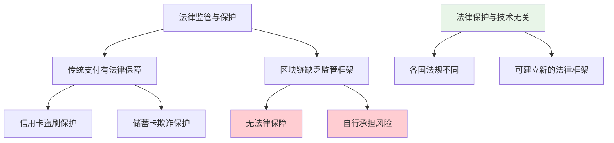

传统支付方式通常有法律保护机制。例如，在美国，信用卡被盗刷时，持卡人及时报告后最多承担50美元损失；储蓄卡被盗用时，持卡人最多承担500美元损失。而使用比特币等加密货币支付时，这些保护机制目前不存在。

#### 知识点补充：各国支付保护法规对比

| 国家/地区 | 信用卡盗刷保护 | 储蓄卡盗用保护 | 加密货币保护 |
|----------|--------------|--------------|------------|
| **美国** | 最多承担$50 | 最多承担$500 | 无专门法规 |
| **欧盟** | 各国不同，部分有保护 | 各国不同 | 无专门法规 |
| **中国** | 有条件保护 | 有条件保护 | 无专门法规 |
| **日本** | 有条件保护 | 有条件保护 | 部分交易所有保险 |

重要的是，这些法律保护与支付技术本身没有必然联系。不同国家和地区的法律规定差异很大，即使是同一支付技术也可能有不同的法律保护框架。随着加密货币的发展，相应的法律保护机制也可能逐步建立。

## 区块链的适用场景

### 加密货币的正确定位

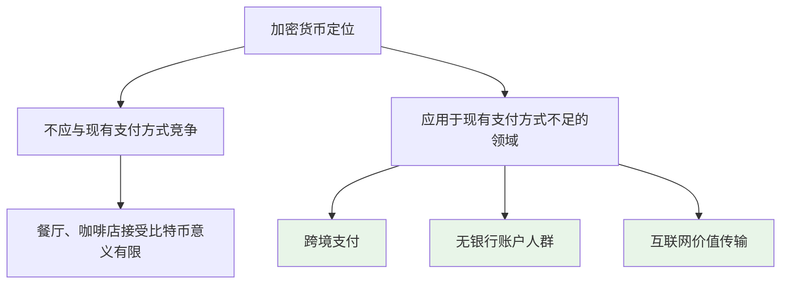

加密货币不应该用于与已有支付方式竞争。在餐厅、咖啡店等场所接受比特币作为支付方式，实际意义有限，因为传统支付方式已经解决得很好。加密货币应该应用于现有支付方式解决不好的领域。

#### 加密货币的理想应用场景

| 场景 | 传统解决方案 | 加密货币优势 |
|------|------------|------------|
| **跨国技术咨询** | 国际银行转账 | 快速、低费用、无中介 |
| **跨境支付** | SWIFT系统 | 24/7可用、无假期延迟 |
| **国际专家合作** | 复杂的支付流程 | 简单直接的价值传输 |
| **无银行账户人群** | 现金、汇款公司 | 只需互联网连接 |

互联网使信息传播变得极为便捷，但支付渠道并未跟上这一发展速度。例如，巴西的客户想聘请中国的技术专家提供咨询服务，通过互联网进行交流毫无问题，但支付环节却面临诸多障碍。传统银行转账周期长、手续费高，而加密货币可以提供更高效的解决方案。

#### 知识点补充：价值互联网(Internet of Value)

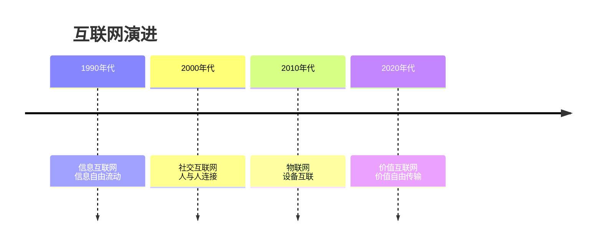

下一代互联网被称为"价值互联网"(Internet of Value)，它将使价值交换像信息传播一样便捷。当前的互联网主要是信息传播网络，信息可以自由流动，但价值交换仍然受到限制。未来的发展趋势是支付渠道与信息传播渠道逐渐融合，使价值交换变得与信息传播同样便利。

## 区块链效率与能耗问题

### 能耗争议的多角度分析

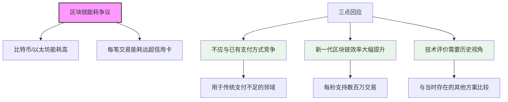

区块链技术，特别是比特币和以太坊，因其高能耗而受到批评。平均到每个交易，其能耗远高于信用卡交易。对此可以从三个方面进行回应：

#### 区块链效率发展对比

| 区块链系统 | 交易处理能力 | 区块大小 | 出块时间 | 共识机制 |
|----------|------------|---------|---------|---------|
| **比特币(原始)** | ~7 TPS | 1MB | ~10分钟 | PoW |
| **以太坊1.0** | ~15-30 TPS | 动态 | ~15秒 | PoW |
| **新一代区块链** | 数千至数百万TPS | 更大 | 更短 | PoS/DPoS等 |
| **传统信用卡网络** | ~1,700-24,000 TPS | - | 实时 | 中心化验证 |

随着区块链技术的发展，共识协议不断改进，新一代区块链在支付效率上已经有了质的飞跃。以太坊相比比特币已经提高了效率，而更新的区块链系统声称每秒可以处理数百万交易。

#### 知识点补充：技术评价的历史视角

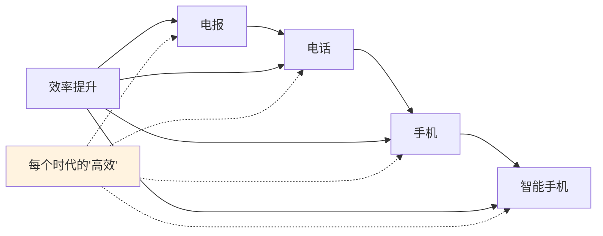

评价一项技术的效率需要在特定的历史条件下进行，与当时存在的其他技术方案进行比较。就像电报在当时是相对高效的通讯手段一样，加密货币在某些应用场景下已经是相对高效的支付方式。

电报作为一种看似低效的通讯方式，在中国使用了很长时间(从清朝末年到20世纪末)，因为在当时的条件下，它是相对高效的选择。同样，加密货币在特定场景下(如跨境支付)可能比传统方式更高效，尽管在其他场景下效率较低。

## 智能合约的争议与发展

### 智能合约安全性问题

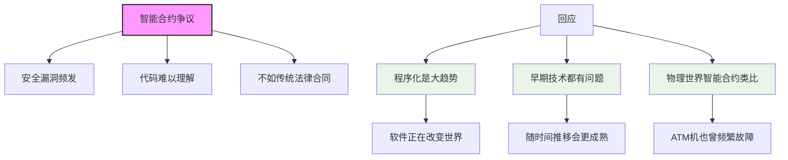

智能合约因安全漏洞频发而受到质疑。有观点认为，传统法律合同使用自然语言编写，普通人可以理解，而智能合约使用编程语言，只有程序员能看懂，反而不利于检查安全漏洞。

#### 智能合约与传统合同对比

| 特征 | 传统法律合同 | 智能合约 |
|------|------------|---------|
| **语言形式** | 自然语言 | 编程语言 |
| **执行方式** | 人工执行 | 自动执行 |
| **修改难度** | 双方协商可修改 | 部署后难以修改 |
| **解释空间** | 有解释余地 | 严格按代码执行 |
| **执行成本** | 可能需要法律诉讼 | 低执行成本 |
| **安全风险** | 合同漏洞 | 代码漏洞 |

对于智能合约的质疑，首先需要认识到程序化是一个大趋势。正如"软件正在吞噬世界"(Software is eating the world)所言，任何技术在转型早期都会有问题，这是正常的。

#### 知识点补充：物理世界的智能合约

ATM机可以看作物理世界中的智能合约，它按照事先设定的规则自动运行。ATM机问世几十年后，仍然会发生故障。在ATM机刚出现时，故障频率肯定更高。但我们不会因为ATM机有故障就否定其价值。

智能合约的历史相对较短(仅有几年)，出现安全漏洞并不奇怪。随着时间推移和技术完善，将来会出现一些智能合约常用功能的成熟模板，安全性将大幅提高。

### 去中心化治理的挑战

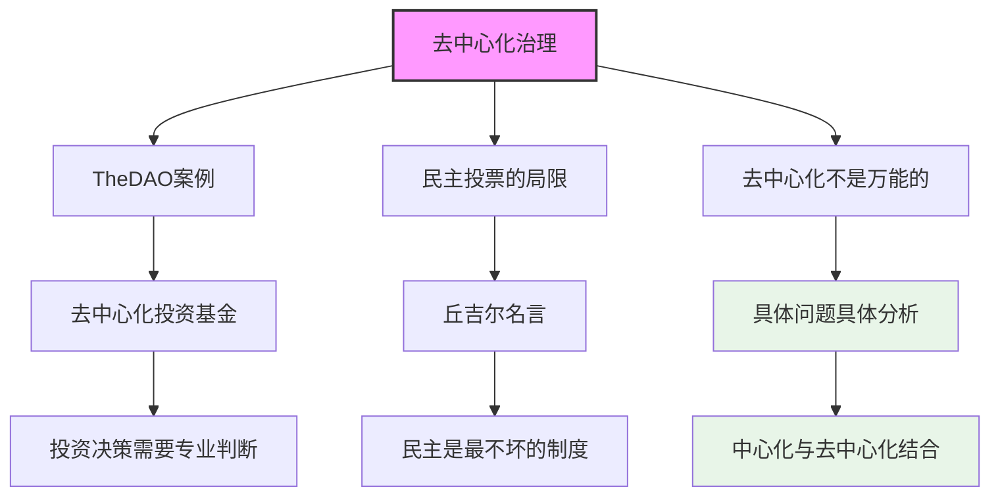

去中心化不应被视为解决所有问题的灵丹妙药。以TheDAO为例，即使没有发生黑客事件，其商业模式本身也存在问题。投资决策需要专业判断，包括尽职调查、创始人评估、财务状况检查等，这些不是简单投票就能完成的。

#### 民主决策的局限性

| 场景 | 民主投票优势 | 民主投票局限 |
|------|------------|------------|
| **政治选举** | 体现民意 | 可能受情绪影响 |
| **投资决策** | 集体智慧 | 缺乏专业判断 |
| **地方财政** | 民主参与 | 短期利益倾向 |
| **技术路线** | 多方意见 | 技术复杂性 |

丘吉尔曾说："民主是最糟糕的政府形式，除了迄今为止人类尝试过的所有其他形式。"(Democracy is the worst form of government, except for all those other forms that have been tried from time to time.)这句话揭示了民主制度虽有缺陷，但相对其他制度仍是较优选择。

#### 知识点补充：互联网泡沫的教训

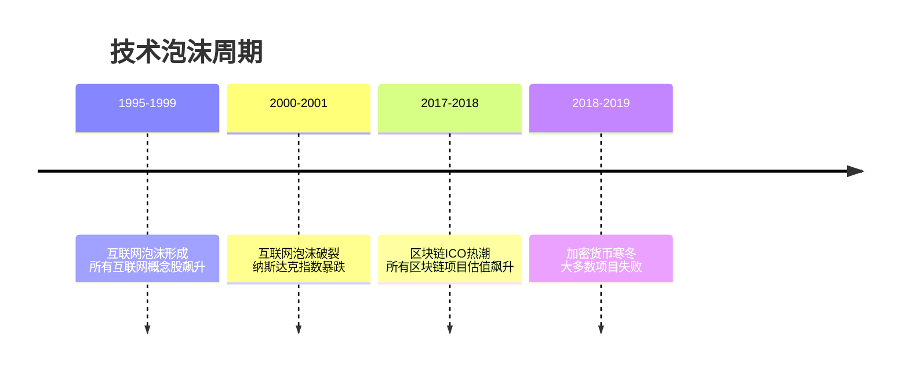

区块链热潮与1990年代末的互联网泡沫有相似之处。当时，任何与互联网相关的公司股票都大幅上涨，包括一些商业模式明显不合理的公司，如在线销售狗粮的公司(运费高于产品价值)。

正如当时有人总结的："如果商业模式本身有问题，放到互联网上也还是有问题。"(If the business model is bad, it's still bad on the Internet.)同样，不良的商业模式即使用去中心化概念包装，也不会变得更好。

## 总结与展望

### 区块链技术的正确认识

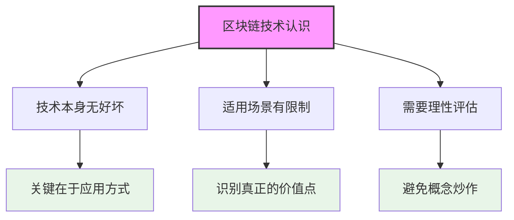

区块链技术本身没有好坏之分，关键在于如何应用。我们需要理性评估区块链技术的适用场景，避免概念炒作和盲目跟风。

### 课程核心要点总结

| 领域 | 核心观点 | 重要性 |
|------|---------|--------|
| **技术定位** | 区块链不是万能解决方案 | 🔴 核心认识 |
| **应用场景** | 应用于现有解决方案不足的领域 | 🔴 关键价值 |
| **去中心化** | 中心化与去中心化可以结合 | 🟡 重要平衡 |
| **价值互联网** | 支付渠道与信息渠道融合 | 🟡 未来趋势 |
| **技术发展** | 效率和安全性将不断提升 | 🟡 发展方向 |

本书籍旨在讲授区块链的技术和应用，而非教导如何"炒币"。课程中提到的所有加密货币例子均为教学目的，不构成任何投资建议。随着区块链技术的不断发展和完善，其应用场景将更加明确，价值也将得到更充分的体现。
